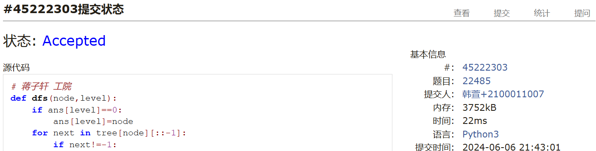
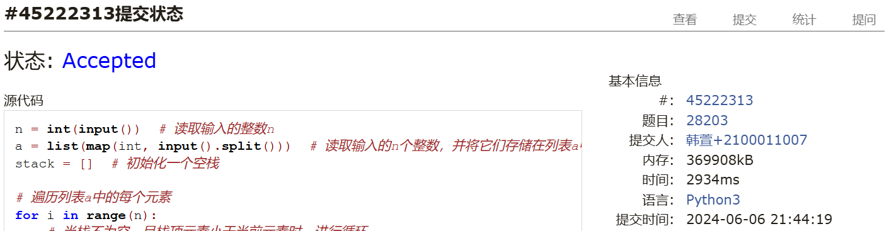
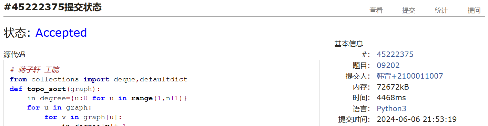
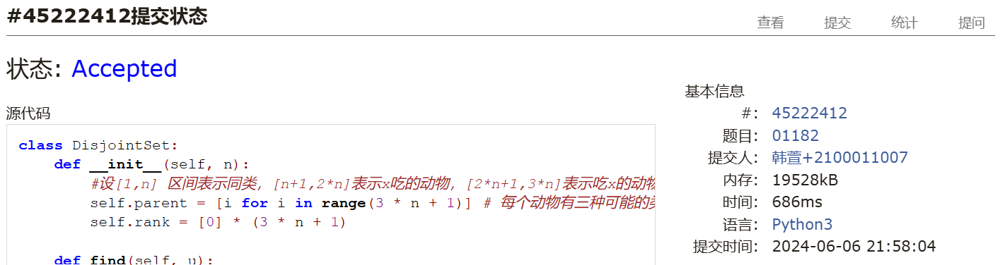

# Assignment #F: All-Killed 满分

Updated 1844 GMT+8 May 20, 2024

2024 spring, Complied by ==同学的姓名、院系==


**说明：**

1）请把每个题目解题思路（可选），源码Python, 或者C++（已经在Codeforces/Openjudge上AC），截图（包含Accepted），填写到下面作业模版中（推荐使用 typora https://typoraio.cn ，或者用word）。AC 或者没有AC，都请标上每个题目大致花费时间。

2）提交时候先提交pdf文件，再把md或者doc文件上传到右侧“作业评论”。Canvas需要有同学清晰头像、提交文件有pdf、"作业评论"区有上传的md或者doc附件。

3）如果不能在截止前提交作业，请写明原因。


**编程环境**

==（请改为同学的操作系统、编程环境等）==

操作系统：macOS Ventura 13.4.1 (c)

Python编程环境：Spyder IDE 5.2.2, PyCharm 2023.1.4 (Professional Edition)

C/C++编程环境：Mac terminal vi (version 9.0.1424), g++/gcc (Apple clang version 14.0.3, clang-1403.0.22.14.1)


## 1. 题目

### 22485: 升空的焰火，从侧面看

http://cs101.openjudge.cn/practice/22485/


思路：


代码

```python
# 蒋子轩 工院
def dfs(node,level):
    # 如果当前层级的答案还未被设置，那么就将当前节点设置为该层级的答案
    if ans[level]==0:
        ans[level]=node
    # 遍历当前节点的所有子节点，从后向前遍历
    for next in tree[node][::-1]:
        # 如果子节点不是-1，那么就对子节点进行深度优先搜索
        if next!=-1:
            dfs(next,level+1)
# 读取节点的数量
n=int(input())
# 初始化树和答案数组
tree={}
ans=[0]*n
# 读取树的结构
for i in range(n):
    tree[i+1]=list(map(int,input().split()))
# 从根节点开始进行深度优先搜索
dfs(1,0)
# 初始化结果数组
res=[]
# 遍历答案数组
for i in ans:
    # 如果答案不是0，那么就将答案添加到结果数组中
    if i: res.append(i)
    # 如果答案是0，那么就结束遍历
    else: break
# 打印结果数组
print(*res)
```


代码运行截图 ==（至少包含有"Accepted"）==



### 28203:【模板】单调栈

http://cs101.openjudge.cn/practice/28203/


思路：


代码

```python
n = int(input())  # 读取输入的整数n
a = list(map(int, input().split()))  # 读取输入的n个整数，并将它们存储在列表a中
stack = []  # 初始化一个空栈

# 遍历列表a中的每个元素
for i in range(n):
    # 当栈不为空，且栈顶元素小于当前元素时，进行循环
    while stack and a[stack[-1]] < a[i]:
        # 将栈顶元素出栈，并将其在列表a中的值更新为i + 1
        a[stack.pop()] = i + 1

    # 将当前元素的索引入栈
    stack.append(i)

# 当栈不为空时，进行循环
while stack:
    # 将栈顶元素出栈，并将其在列表a中的值更新为0
    a[stack[-1]] = 0
    stack.pop()

# 打印列表a中的所有元素
print(*a)
```


代码运行截图 ==（至少包含有"Accepted"）==



### 09202: 舰队、海域出击！

http://cs101.openjudge.cn/practice/09202/


思路：拓扑排序检查有向图是否存在环

```python
# 蒋子轩 工院
from collections import deque,defaultdict
def topo_sort(graph):
    in_degree={u:0 for u in range(1,n+1)}
    for u in graph:
        for v in graph[u]:
            in_degree[v]+=1
    q=deque([u for u in in_degree if in_degree[u]==0])
    topo_order=[]
    while q:
        u=q.popleft()
        topo_order.append(u)
        for v in graph[u]:
            in_degree[v]-=1
            if in_degree[v]==0:
                q.append(v)
    if len(topo_order)!=len(graph):
        return 'Yes'
    return 'No'
for _ in range(int(input())):
    n,m=map(int,input().split())
    graph=defaultdict(list)
    for _ in range(m):
        u,v=map(int,input().split())
        graph[u].append(v)
    print(topo_sort(graph))
```


代码运行截图 ==（AC代码截图，至少包含有"Accepted"）==



### 04135: 月度开销

http://cs101.openjudge.cn/practice/04135/


思路：计概就做过


代码

```python
n, m = map(int, input().split())
line = [int(input()) for _ in range(n)]
fl = max(line)
ce = sum(line)
mid = fl + (ce-fl)//2
while ce != fl:
    count = 0
    ans = 1
    for i in range(n):
        count += line[i]
        if count > mid:
            count = line[i]
            ans += 1
        elif count == mid:
            count = 0
            ans += 1
    if ans <= m:
        ce = mid
    else:
        fl = mid + 1
    mid = fl + (ce-fl)//2
print(mid)
```


代码运行截图 ==（AC代码截图，至少包含有"Accepted"）==
！[](./assignmentF.4.png)


### 07735: 道路

http://cs101.openjudge.cn/practice/07735/


思路：dijkstra变体，要删去visited检查。

```python
#何秉儒 物理学院
import heapq

def dijkstra(g):
    while pq:
        dist,node,fee = heapq.heappop(pq)
        if node == n-1 :
            return dist
        for nei,w,f in g[node]:
            n_dist = dist + w
            n_fee = fee + f
            if n_fee <= k:
                dists[nei] = n_dist
                heapq.heappush(pq,(n_dist,nei,n_fee))
    return -1

k,n,r = int(input()),int(input()),int(input())
g = [[] for _ in range(n)]
for i in range(r):
    s,d,l,t = map(int,input().split())
    g[s-1].append((d-1,l,t)) #node,dist,fee

pq = [(0,0,0)] #dist,node,fee
dists = [float('inf')] * n
dists[0] = 0
spend = 0

result = dijkstra(g)
print(result)

```


代码运行截图 ==（AC代码截图，至少包含有"Accepted"）==
！[](./assignmentF.5.png)


### 01182: 食物链

http://cs101.openjudge.cn/practice/01182/


思路：动物王国中有三类动物A,B,C，这三类动物的食物链构成了有趣的环形。A吃B， B吃C，C吃A。
意思就是所有的种类只有A,B,C三种，只有三个关系A吃B， B吃C，C吃A。
思路：创建3个分组i-A,i-B,i-C。
如果x和y是同类，正确则合并x-A和y-A、x-B和y-B、x-C和y-C。
　　　　　　　　当存在x吃y或者y吃x时不正确。
如果x吃y，正确则合并x-A和y-B、x-B和y-C、x-C和y-A。
　　　　　　当存在x和y是同类或者y吃x时不正确。

这题还有一个特殊之处，在于当两个的吃与被吃关系定下来，由于环形结构，另一个的吃与被吃关系就确定了，因此需要合并三次。

```python
class DisjointSet:
    def __init__(self, n):
        #设[1,n] 区间表示同类，[n+1,2*n]表示x吃的动物，[2*n+1,3*n]表示吃x的动物。
        self.parent = [i for i in range(3 * n + 1)] # 每个动物有三种可能的类型，用 3 * n 来表示每种类型的并查集
        self.rank = [0] * (3 * n + 1)

    def find(self, u):
        if self.parent[u] != u:
            self.parent[u] = self.find(self.parent[u])
        return self.parent[u]

    def union(self, u, v):
        pu, pv = self.find(u), self.find(v)
        if pu == pv:
            return False
        if self.rank[pu] > self.rank[pv]:
            self.parent[pv] = pu
        elif self.rank[pu] < self.rank[pv]:
            self.parent[pu] = pv
        else:
            self.parent[pv] = pu
            self.rank[pu] += 1
        return True


def is_valid(n, k, statements):
    dsu = DisjointSet(n)

    def find_disjoint_set(x):
        if x > n:
            return False
        return True

    false_count = 0
    for d, x, y in statements:
        if not find_disjoint_set(x) or not find_disjoint_set(y):
            false_count += 1
            continue
        if d == 1:  # X and Y are of the same type
            if dsu.find(x) == dsu.find(y + n) or dsu.find(x) == dsu.find(y + 2 * n):
                false_count += 1
            else:
                dsu.union(x, y)
                dsu.union(x + n, y + n)
                dsu.union(x + 2 * n, y + 2 * n)
        else:  # X eats Y
            if dsu.find(x) == dsu.find(y) or dsu.find(x + 2*n) == dsu.find(y):
                false_count += 1
            else: #[1,n] 区间表示同类，[n+1,2*n]表示x吃的动物，[2*n+1,3*n]表示吃x的动物
                dsu.union(x + n, y)
                dsu.union(x, y + 2 * n)
                dsu.union(x + 2 * n, y + n)

    return false_count


if __name__ == "__main__":
    N, K = map(int, input().split())
    statements = []
    for _ in range(K):
        D, X, Y = map(int, input().split())
        statements.append((D, X, Y))
    result = is_valid(N, K, statements)
    print(result)

```


代码运行截图 ==（AC代码截图，至少包含有"Accepted"）==



## 2. 学习总结和收获

==如果作业题目简单，有否额外练习题目，比如：OJ“2024spring每日选做”、CF、LeetCode、洛谷等网站题目。==
没时间写，就看题解了


