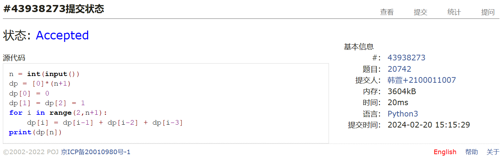
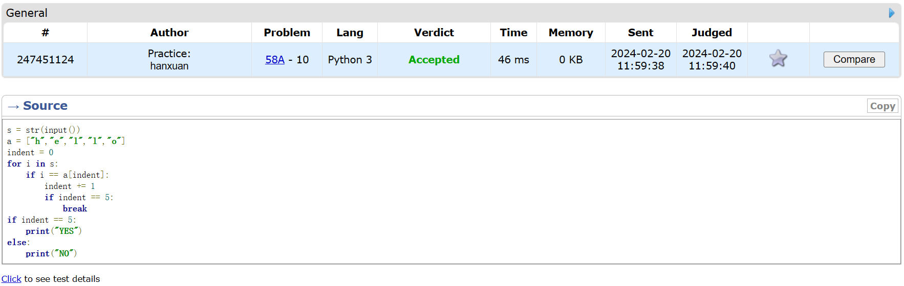
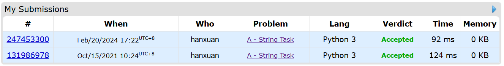
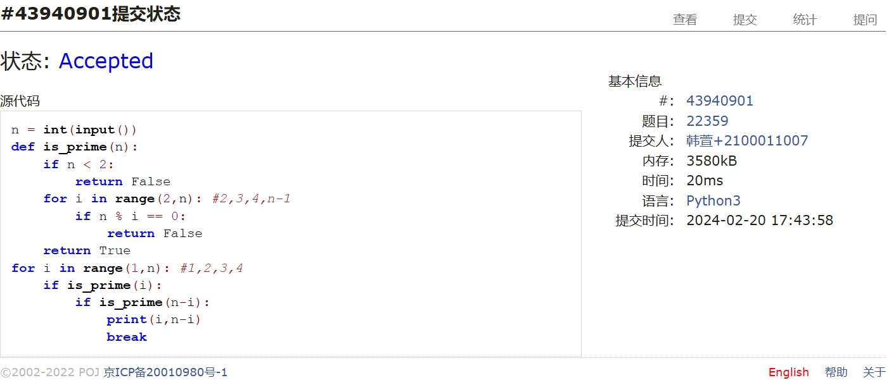
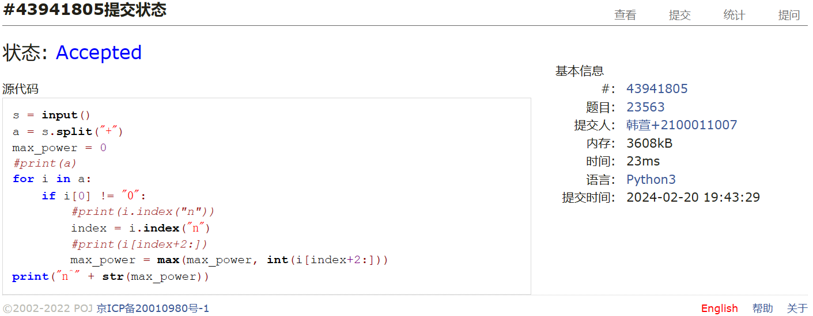
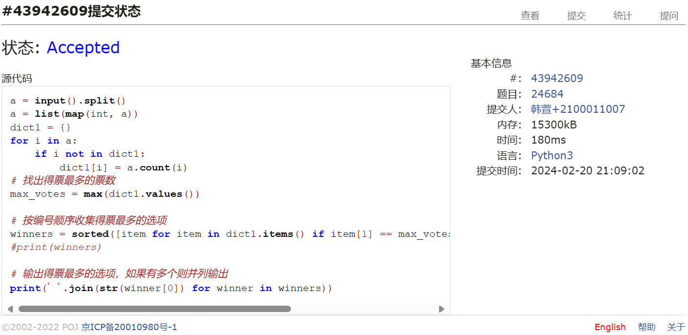

# Assignment #1: 拉齐大家Python水平

Updated 0940 GMT+8 Feb 19, 2024

2024 spring, Complied by ==韩萱 工学院==

我的课程主页https://github.com/hanxuan0422/2024spring-cs201


**说明：**

1）数算课程的先修课是计概，由于计概学习中可能使用了不同的编程语言，而数算课程要求Python语言，因此第一周作业练习Python编程。如果有同学坚持使用C/C++，也可以，但是建议也要会Python语言。

2）请把每个题目解题思路（可选），源码Python, 或者C++（已经在Codeforces/Openjudge上AC），截图（包含Accepted），填写到下面作业模版中（推荐使用 typora https://typoraio.cn ，或者用word）。AC 或者没有AC，都请标上每个题目大致花费时间。

3）课程网站是Canvas平台, https://pku.instructure.com, 学校通知3月1日导入选课名单后启用。**作业写好后，保留在自己手中，待3月1日提交。**

提交时候先提交pdf文件，再把md或者doc文件上传到右侧“作业评论”。Canvas需要有同学清晰头像、提交文件有pdf、"作业评论"区有上传的md或者doc附件。

4）如果不能在截止前提交作业，请写明原因。


**编程环境**

==（请改为同学的操作系统、编程环境等）==

操作系统：Windows 11 家庭中文版 22H2

Python编程环境：Visual Studio Code

C/C++编程环境：Visual Studio Code


## 1. 题目

### 20742: 泰波拿契數

http://cs101.openjudge.cn/practice/20742/


思路：最基本的动态规划题，找到状态转移方程dp[i] = dp[i-1] + dp[i-2] + dp[i-3]，然后循环到n的情况即可。1min


##### 代码

```python
n = int(input())
dp = [0]*(n+1)
dp[0] = 0
dp[1] = dp[2] = 1
for i in range(2,n+1):
    dp[i] = dp[i-1] + dp[i-2] + dp[i-3]
print(dp[n])
```


代码运行截图 ==（至少包含有"Accepted"）==



### 58A. Chat room

greedy/strings, 1000, http://codeforces.com/problemset/problem/58/A


思路：设置一个数组s["h","e","l","l","o"]，设置一个index来遍历s，再遍历字符串，每按照顺序遇到一个字母就index+=1，index到了5就立刻终止循环。1min


##### 代码

```python
s = str(input())
a = ["h","e","l","l","o"]
indent = 0
for i in s:
    if i == a[indent]:
        indent += 1
        if indent == 5:
            break
if indent == 5:
    print("YES")
else:
    print("NO")
```


代码运行截图 ==（至少包含有"Accepted"）==



### 118A. String Task

implementation/strings, 1000, http://codeforces.com/problemset/problem/118/A


思路：lower()预处理一下，然后遍历即可。2min，发现2021年做过这道题。


##### 代码

```python
s = str(input())
s = s.lower()
a = ["a","o","y","e","u","i"]
ans = str("")
for i in s:
    if i in a:
        continue
    else:
        ans += "."
        ans += i
print(ans)
```


代码运行截图 ==（AC代码截图，至少包含有"Accepted"）==



### 22359: Goldbach Conjecture

http://cs101.openjudge.cn/practice/22359/


思路：今天的作业都不需要算法，写个is_prime的函数然后判断一下就行。5min


##### 代码

```python
n = int(input())
def is_prime(n):
    if n < 2:
        return False
    for i in range(2,n): #2,3,4,n-1
        if n % i == 0:
            return False
    return True
for i in range(1,n): #1,2,3,4
    if is_prime(i):
        if is_prime(n-i):
            print(i,n-i)
            break
```


代码运行截图 ==（AC代码截图，至少包含有"Accepted"）==



### 23563: 多项式时间复杂度

http://cs101.openjudge.cn/practice/23563/


思路：简化代码的重点是split("+")和index("n")，好久没写python有点忘了。20min


##### 代码

```python
s = input()
a = s.split("+")
max_power = 0
#print(a)
for i in a:
    if i[0] != "0":
        #print(i.index("n"))
        index = i.index("n")
        #print(i[index+2:])
        max_power = max(max_power, int(i[index+2:]))
print("n^" + str(max_power))
```


代码运行截图 ==（AC代码截图，至少包含有"Accepted"）==



### 24684: 直播计票

http://cs101.openjudge.cn/practice/24684/


思路：本来想用朴素的计数方式，但隐约记得之前做过这道题并且python有更好的方法，一搜果然，python的字典有这个特殊的语法可以计数。

```python
#重点是python字典,map(),count(),sorted()函数运用
map(function, iterable, ...) #python3返回迭代器
l.count()
sorted([(),(),()])
dict1.items()
split()直接就可以分割空格，不需要" "参数
```

写多了c++都忘记python这些快捷方式的语法了。30min


```python
a = input().split()
a = list(map(int, a))
dict1 = {}
for i in a:
    if i not in dict1:
        dict1[i] = a.count(i)
# 找出得票最多的票数
max_votes = max(dict1.values())

# 按编号顺序收集得票最多的选项
winners = sorted([item for item in dict1.items() if item[1] == max_votes]) #winners是一个列表，列表中的元素是元组
#print(winners)

# 输出得票最多的选项，如果有多个则并列输出
print(' '.join(str(winner[0]) for winner in winners))
```

```python
#题解
from collections import defaultdict

# 读取输入并转换成整数列表
votes = list(map(int, input().split()))

# 使用字典统计每个选项的票数
vote_counts = defaultdict(int)
for vote in votes:
    vote_counts[vote] += 1

# 找出得票最多的票数
max_votes = max(vote_counts.values())

# 按编号顺序收集得票最多的选项
winners = sorted([item for item in vote_counts.items() if item[1] == max_votes])

# 输出得票最多的选项，如果有多个则并列输出
print(' '.join(str(winner[0]) for winner in winners))
```

代码运行截图 ==（AC代码截图，至少包含有"Accepted"）==



## 2. 学习总结和收获

==如果作业题目简单，有否额外练习题目，比如：OJ“数算pre每日选做”、CF、LeetCode、洛谷等网站题目。==

题目很简单，所以把2.20的三道oj选做题也做了。

我是大三学生，21年选了闫老师的计算概论B拿了97分，感觉闫老师的课课程体验感最好，能大大提升代码能力，并且确实是一分耕耘一分收获，甚至是本科三年来收获最大体验感最好的课程。这次看到闫老师开了数算B马上就选了，很高兴能和闫老师在数算B重逢。


```python
map(function, iterable, ...) #python3返回迭代器
l.count()
sorted([(),(),()])
dict1.items() #返回元组
split()直接就可以分割空格，不需要" "参数

#没有说明行数的这样写
from math import gcd
    while True:
        try:
            a，b = input().split()
            print(gcd(int(a), int(b)))
        except EOFError:
            break
```

```python
a = input().split()
a = list(map(int, a))
dict1 = {}
for i in a:
    if i not in dict1:
        dict1[i] = a.count(i)
# 找出得票最多的票数
max_votes = max(dict1.values())

# 按编号顺序收集得票最多的选项
winners = sorted([item for item in dict1.items() if item[1] == max_votes]) #winners是一个列表，列表中的元素是元组
#print(winners)

# 输出得票最多的选项，如果有多个则并列输出
print(' '.join(str(winner[0]) for winner in winners))
```

>>>a = [5,7,6,3,4,1,2]
>>> b = sorted(a)       # 保留原列表
>>> a 
[5, 7, 6, 3, 4, 1, 2]
>>> b
[1, 2, 3, 4, 5, 6, 7]
 
>>> L=[('b',2),('a',1),('c',3),('d',4)]
>>> sorted(L, cmp=lambda x,y:cmp(x[1],y[1]))   # 利用cmp函数
[('a', 1), ('b', 2), ('c', 3), ('d', 4)]
>>> sorted(L, key=lambda x:x[1])               # 利用key
[('a', 1), ('b', 2), ('c', 3), ('d', 4)]
 
 
>>> students = [('john', 'A', 15), ('jane', 'B', 12), ('dave', 'B', 10)]
>>> sorted(students, key=lambda s: s[2])            # 按年龄排序
[('dave', 'B', 10), ('jane', 'B', 12), ('john', 'A', 15)]
 
>>> sorted(students, key=lambda s: s[2], reverse=True)       # 按降序
[('john', 'A', 15), ('jane', 'B', 12), ('dave', 'B', 10)]
>>>


index()的用法
```python
s = input()
a = s.split("+")
max_power = 0
#print(a)
for i in a:
    if i[0] != "0":
        #print(i.index("n"))
        index = i.index("n")
        #print(i[index+2:])
        max_power = max(max_power, int(i[index+2:]))
print("n^" + str(max_power))
```