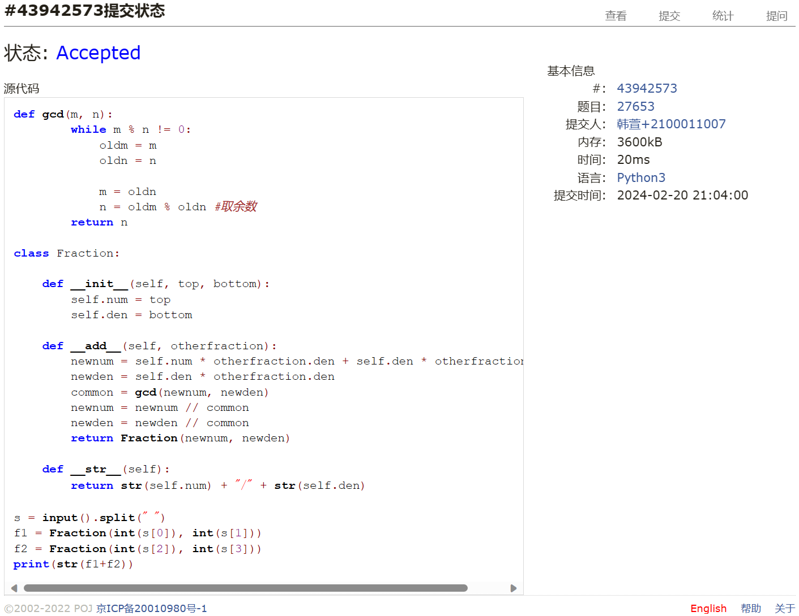
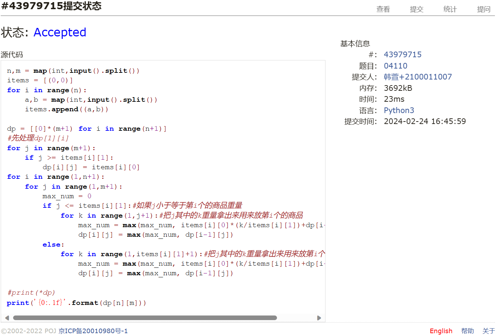
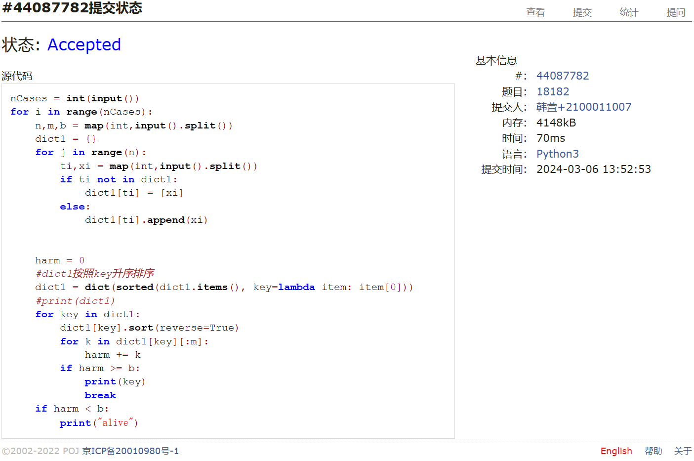
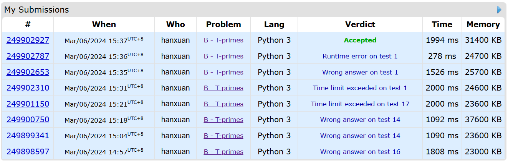
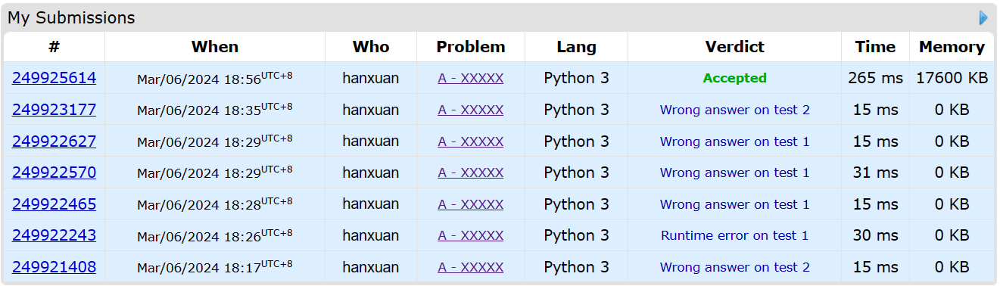
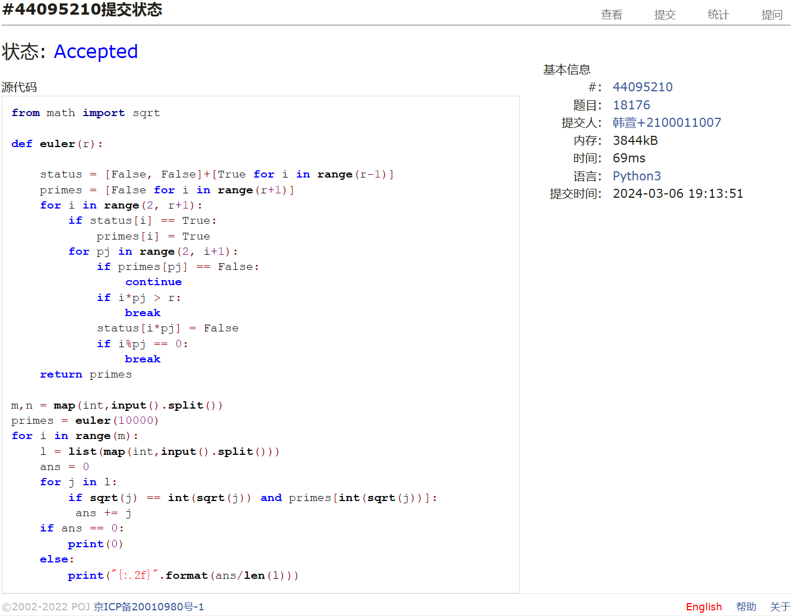

# Assignment #2: 编程练习

Updated 0953 GMT+8 Feb 24, 2024

2024 spring, Complied by ==韩萱 工学院==

我的课程主页https://github.com/hanxuan0422/2024spring-cs201


**说明：**

1）The complete process to learn DSA from scratch can be broken into 4 parts:
- Learn about Time and Space complexities
- Learn the basics of individual Data Structures
- Learn the basics of Algorithms
- Practice Problems on DSA

2）请把每个题目解题思路（可选），源码Python, 或者C++（已经在Codeforces/Openjudge上AC），截图（包含Accepted），填写到下面作业模版中（推荐使用 typora https://typoraio.cn ，或者用word）。AC 或者没有AC，都请标上每个题目大致花费时间。

3）课程网站是Canvas平台, https://pku.instructure.com, 学校通知3月1日导入选课名单后启用。**作业写好后，保留在自己手中，待3月1日提交。**

提交时候先提交pdf文件，再把md或者doc文件上传到右侧“作业评论”。Canvas需要有同学清晰头像、提交文件有pdf、"作业评论"区有上传的md或者doc附件。

4）如果不能在截止前提交作业，请写明原因。


**编程环境**

==（请改为同学的操作系统、编程环境等）==

操作系统：Windows 11 家庭中文版 22H2

Python编程环境：Visual Studio Code

C/C++编程环境：Visual Studio Code


## 1. 题目

### 27653: Fraction类

http://cs101.openjudge.cn/2024sp_routine/27653/


思路：按照讲义抄的。1min


##### 代码

```python
def gcd(m, n):
        while m % n != 0:
            oldm = m
            oldn = n

            m = oldn
            n = oldm % oldn #取余数
        return n

class Fraction:

    def __init__(self, top, bottom):
        self.num = top
        self.den = bottom

    def __add__(self, otherfraction):
        newnum = self.num * otherfraction.den + self.den * otherfraction.num
        newden = self.den * otherfraction.den
        common = gcd(newnum, newden)
        newnum = newnum // common
        newden = newden // common
        return Fraction(newnum, newden)
    
    def __str__(self):
        return str(self.num) + "/" + str(self.den)

s = input().split(" ")
f1 = Fraction(int(s[0]), int(s[1]))
f2 = Fraction(int(s[2]), int(s[3]))
print(str(f1+f2))
```


代码运行截图 ==（至少包含有"Accepted"）==



### 04110: 圣诞老人的礼物-Santa Clau’s Gifts

greedy/dp, http://cs101.openjudge.cn/practice/04110


思路：背包问题，我看着算法图解写的，但重要的一点不同是：每箱糖果都可以拆分成任意散装组合带走，所以相当于每次填dp[i][j]的时候，要再多套一个循环k，考虑把新增加的糖果拆成(k/糖果总重量)的情况。1h15min终于ac了，狠狠复习了一下python迭代器range(n)的范围是0,1,2,3,...,n-1
后来我看2021年做过这题，好像最后是抄答案了，答案写的比我简单很多


##### 代码

```python
n,m = map(int,input().split())
items = [(0,0)]
for i in range(n):
    a,b = map(int,input().split())
    items.append((a,b))

dp = [[0]*(m+1) for i in range(n+1)]
#先处理dp[1][i]
for j in range(m+1):
    if j >= items[i][1]:
        dp[i][j] = items[i][0]
for i in range(1,n+1):
    for j in range(1,m+1):
        max_num = 0
        if j <= items[i][1]:#如果j小于等于第i个的商品重量
            for k in range(1,j+1):#把j其中的k重量拿出来用来放第i个的商品
                max_num = max(max_num, items[i][0]*(k/items[i][1])+dp[i-1][j-k])
                dp[i][j] = max(max_num, dp[i-1][j])
        else:
            for k in range(1,items[i][1]+1):#把j其中的k重量拿出来用来放第i个的商品
                max_num = max(max_num, items[i][0]*(k/items[i][1])+dp[i-1][j-k])
                dp[i][j] = max(max_num, dp[i-1][j])

#print(*dp)
print('{0:.1f}'.format(dp[n][m]))
```

```python
#分成w=1的小礼物，把性价比高的排在前面即可
n, w = map(int, input().split())
candies = []

for _ in range(n):
    p, q = map(int, input().split())
    for _ in range(q):
        candies.append(p / q)

candies.sort(reverse=True)

'''
Degenerate slice indices are handled gracefully: an index that is too large 
is replaced by the string size, an upper bound smaller than the lower bound 
returns an empty string." e.g.:
    
w = [1,2,3]; sum(w[:6])
Out: 6
'''
value = sum(candies[:w])

print("{:.1f}".format(value))
```

代码运行截图 ==（至少包含有"Accepted"）==



### 18182: 打怪兽

implementation/sortings/data structures, http://cs101.openjudge.cn/practice/18182/


思路：几个易错点全都踩到了,gpt帮我找错,改了好几遍:每时刻只能放m个技能;怪兽死了就要break;注意循环变量名称不要重名.50min


##### 代码

```python
nCases = int(input())
for i in range(nCases):
    n,m,b = map(int,input().split())
    dict1 = {}
    for j in range(n):
        ti,xi = map(int,input().split())
        if ti not in dict1:
            dict1[ti] = [xi]
        else:
            dict1[ti].append(xi)
    

    harm = 0
    #dict1按照key升序排序
    dict1 = dict(sorted(dict1.items(), key=lambda item: item[0]))
    #print(dict1)
    for key in dict1:
        dict1[key].sort(reverse=True)
        for k in dict1[key][:m]:
            harm += k
        if harm >= b:
            print(key)
            break
    if harm < b:
        print("alive")
```


代码运行截图 ==（AC代码截图，至少包含有"Accepted"）==



### 230B. T-primes

binary search/implementation/math/number theory, 1300, http://codeforces.com/problemset/problem/230/B


思路：T-primes其实就是所有质数的平方数,用欧拉筛找出[1,n]的质数.欧拉筛我是看着这个视频写的:【欧拉筛，几行就行，一次就好-哔哩哔哩】 https://b23.tv/mOQVIc0
然后不能用 in primes,是要做一个长度为n的primes表,然后判断primes[n]==1


##### 代码

```python
from math import sqrt

def euler(r):

    status = [False, False]+[True for i in range(r-1)]
    primes = [False for i in range(r+1)]
    for i in range(2, r+1):
        if status[i] == True:
            primes[i] = True
        for pj in range(2, i+1):
            if primes[pj] == False:
                continue
            if i*pj > r:
                break
            status[i*pj] = False
            if i%pj == 0:
                break
    return primes

nCases = int(input())
list1 = [i for i in map(int,input().split())]
primes = euler(1000000)
#print(primes)
for i in list1:
    if sqrt(i) == int(sqrt(i)) and primes[int(sqrt(i))]:
        print("YES")
    else:
        print("NO")


```


代码运行截图 ==（AC代码截图，至少包含有"Accepted"）==



### 1364A. XXXXX

brute force/data structures/number theory/two pointers, 1200, https://codeforces.com/problemset/problem/1364/A


思路：其实是个数学题,如果列表总和能被整除,那目标就是从两头逐步找离两端最近的那个不能被整除的数,找不到的话就是-1.1h


##### 代码

```python
t = int(input())
for i in range(t):
    n,x = map(int, input().split())
    l = list(map(int, input().split()))
    
    sum = 0
    for i in range(n):
        sum += l[i]
    
    if sum % x != 0:
        print(len(l))
    else:
        for i in range(n//2+1):
            if (sum - l[i]) % x != 0 or (sum - l[n-i-1]) % x != 0:
                print(len(l) - 1 -i)
                break
            if i == n//2:
                print(-1)
```


代码运行截图 ==（AC代码截图，至少包含有"Accepted"）==



### 18176: 2050年成绩计算

http://cs101.openjudge.cn/practice/18176/


思路：还是t-prime.10min


##### 代码

```python
from math import sqrt

def euler(r):

    status = [False, False]+[True for i in range(r-1)]
    primes = [False for i in range(r+1)]
    for i in range(2, r+1):
        if status[i] == True:
            primes[i] = True
        for pj in range(2, i+1):
            if primes[pj] == False:
                continue
            if i*pj > r:
                break
            status[i*pj] = False
            if i%pj == 0:
                break
    return primes

m,n = map(int,input().split())
primes = euler(10000)
for i in range(m):
    l = list(map(int,input().split()))
    ans = 0
    for j in l:
        if sqrt(j) == int(sqrt(j)) and primes[int(sqrt(j))]:
         ans += j
    if ans == 0:
        print(0)
    else:
        print("{:.2f}".format(ans/len(l)))
```


代码运行截图 ==（AC代码截图，至少包含有"Accepted"）==



## 2. 学习总结和收获

==如果作业题目简单，有否额外练习题目，比如：OJ“2024spring每日选做”、CF、LeetCode、洛谷等网站题目。==

保留一位小数 print('{0:.1f}'.format(ans))
python迭代器range(n)的范围是0,1,2,3,...,n-1
```python
#dict1按照key升序排序
    dict1 = dict(sorted(dict1.items(), key=lambda item: item[0]))
```

```python
#小数
print("{:.4f}".format(value))
```