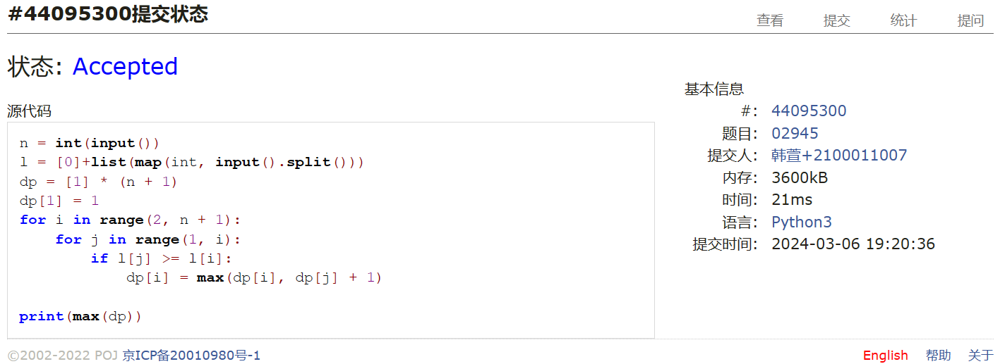
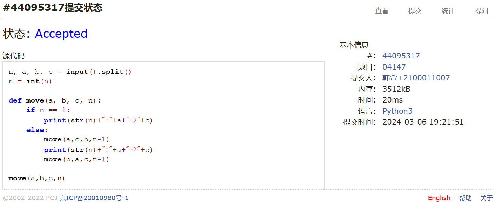
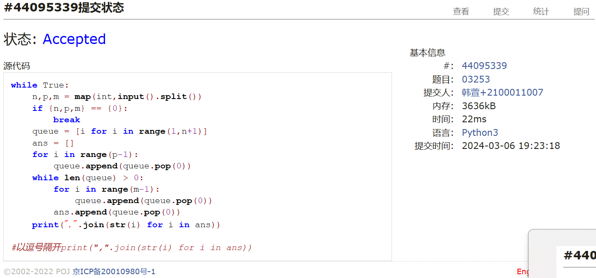
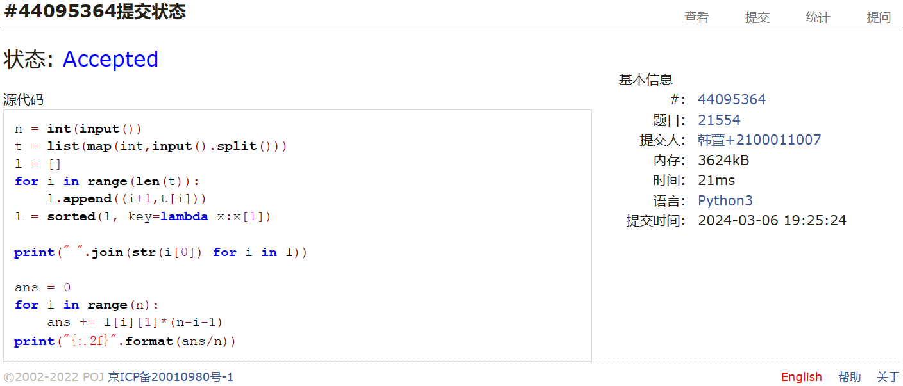
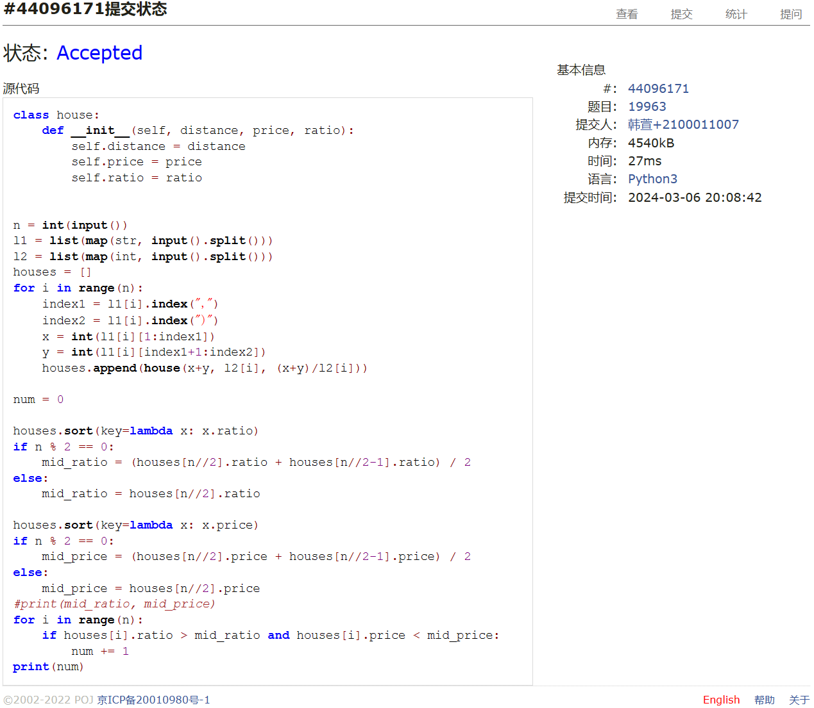
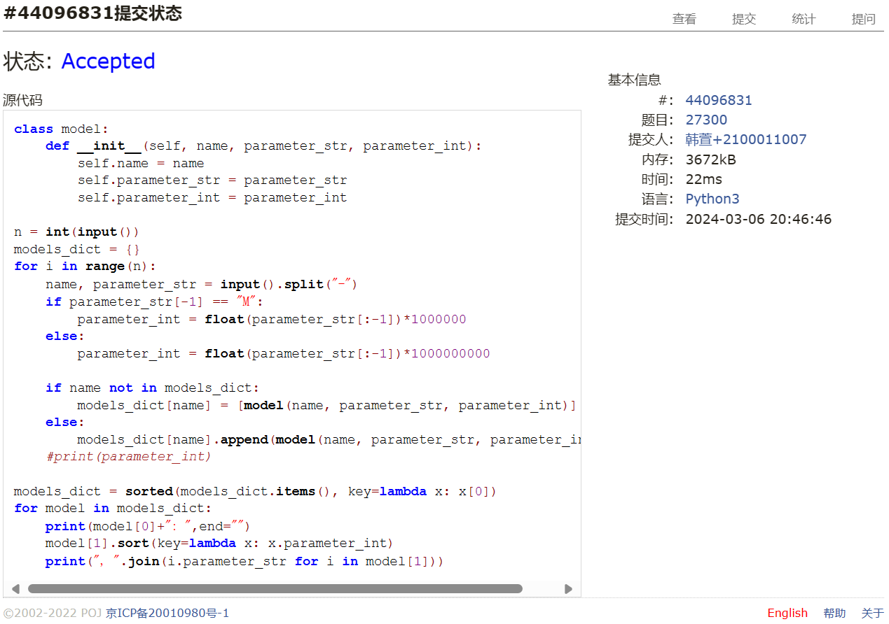

# Assignment #3: March月考

Updated 1537 GMT+8 March 6, 2024

2024 spring, Complied by ==韩萱 工学院==

我的课程主页https://github.com/hanxuan0422/2024spring-cs201


**说明：**

1）The complete process to learn DSA from scratch can be broken into 4 parts:
- Learn about Time and Space complexities
- Learn the basics of individual Data Structures
- Learn the basics of Algorithms
- Practice Problems on DSA

2）请把每个题目解题思路（可选），源码Python, 或者C++（已经在Codeforces/Openjudge上AC），截图（包含Accepted），填写到下面作业模版中（推荐使用 typora https://typoraio.cn ，或者用word）。AC 或者没有AC，都请标上每个题目大致花费时间。

3）提交时候先提交pdf文件，再把md或者doc文件上传到右侧“作业评论”。Canvas需要有同学清晰头像、提交文件有pdf、"作业评论"区有上传的md或者doc附件。

4）如果不能在截止前提交作业，请写明原因。


**编程环境**

==（请改为同学的操作系统、编程环境等）==

操作系统：Windows 11 家庭中文版 22H2

Python编程环境：Visual Studio Code

C/C++编程环境：Visual Studio Code


## 1. 题目

**02945: 拦截导弹**

http://cs101.openjudge.cn/practice/02945/


思路：dp,最长下降子序列


##### 代码

```python
n = int(input())
l = [0]+list(map(int, input().split()))
dp = [1] * (n + 1)
dp[1] = 1
for i in range(2, n + 1):
    for j in range(1, i):
        if l[j] >= l[i]:
            dp[i] = max(dp[i], dp[j] + 1)

print(max(dp))
```


代码运行截图 ==（至少包含有"Accepted"）==



**04147:汉诺塔问题(Tower of Hanoi)**

http://cs101.openjudge.cn/practice/04147


思路：递归


##### 代码

```python
n, a, b, c = input().split()
n = int(n)

def move(a, b, c, n):
    if n == 1:
        print(str(n)+":"+a+"->"+c)
    else:
        move(a,c,b,n-1)
        print(str(n)+":"+a+"->"+c)
        move(b,a,c,n-1)

move(a,b,c,n)
```


代码运行截图 ==（至少包含有"Accepted"）==



**03253: 约瑟夫问题No.2**

http://cs101.openjudge.cn/practice/03253


思路：按照讲义上的队列写的


##### 代码

```python
while True:
    n,p,m = map(int,input().split())
    if {n,p,m} == {0}:
        break
    queue = [i for i in range(1,n+1)]
    ans = []
    for i in range(p-1):
        queue.append(queue.pop(0))
    while len(queue) > 0:
        for i in range(m-1):
            queue.append(queue.pop(0))
        ans.append(queue.pop(0))
    print(",".join(str(i) for i in ans))

#以逗号隔开print(",".join(str(i) for i in ans))
```


代码运行截图 ==（AC代码截图，至少包含有"Accepted"）==



**21554:排队做实验 (greedy)v0.2**

http://cs101.openjudge.cn/practice/21554


思路：


##### 代码

```python
n = int(input())
t = list(map(int,input().split()))
l = []
for i in range(len(t)):
    l.append((i+1,t[i]))
l = sorted(l, key=lambda x:x[1])

print(" ".join(str(i[0]) for i in l))

ans = 0
for i in range(n):
    ans += l[i][1]*(n-i-1)  
print("{:.2f}".format(ans/n))
```


代码运行截图 ==（AC代码截图，至少包含有"Accepted"）==



**19963:买学区房**

http://cs101.openjudge.cn/practice/19963


思路：简单.30min


##### 代码

```python
class house:
    def __init__(self, distance, price, ratio):
        self.distance = distance
        self.price = price
        self.ratio = ratio


n = int(input())
l1 = list(map(str, input().split()))
l2 = list(map(int, input().split()))
houses = []
for i in range(n):
    index1 = l1[i].index(",")
    index2 = l1[i].index(")")
    x = int(l1[i][1:index1])
    y = int(l1[i][index1+1:index2])
    houses.append(house(x+y, l2[i], (x+y)/l2[i]))

num = 0

houses.sort(key=lambda x: x.ratio)
if n % 2 == 0:
    mid_ratio = (houses[n//2].ratio + houses[n//2-1].ratio) / 2
else:
    mid_ratio = houses[n//2].ratio

houses.sort(key=lambda x: x.price)
if n % 2 == 0:
    mid_price = (houses[n//2].price + houses[n//2-1].price) / 2
else:
    mid_price = houses[n//2].price
#print(mid_ratio, mid_price)
for i in range(n):
    if houses[i].ratio > mid_ratio and houses[i].price < mid_price:
        num += 1
print(num)
```


代码运行截图 ==（AC代码截图，至少包含有"Accepted"）==



**27300: 模型整理**

http://cs101.openjudge.cn/practice/27300


思路：这道题用到了字典和列表的sorted/sort函数,dict没有sort()函数,list有.40min


##### 代码

```python
class model:
    def __init__(self, name, parameter_str, parameter_int):
        self.name = name
        self.parameter_str = parameter_str
        self.parameter_int = parameter_int

n = int(input())
models_dict = {}
for i in range(n):
    name, parameter_str = input().split("-")
    if parameter_str[-1] == "M":
        parameter_int = float(parameter_str[:-1])*1000000
    else:
        parameter_int = float(parameter_str[:-1])*1000000000
    
    if name not in models_dict:
        models_dict[name] = [model(name, parameter_str, parameter_int)]
    else:
        models_dict[name].append(model(name, parameter_str, parameter_int))
    #print(parameter_int)

models_dict = sorted(models_dict.items(), key=lambda x: x[0])
for model in models_dict:
    print(model[0]+": ",end="")
    model[1].sort(key=lambda x: x.parameter_int)
    print(", ".join(i.parameter_str for i in model[1]))
```


代码运行截图 ==（AC代码截图，至少包含有"Accepted"）==



## 2. 学习总结和收获

==如果作业题目简单，有否额外练习题目，比如：OJ“2024spring每日选做”、CF、LeetCode、洛谷等网站题目。==
幸好没怎么做选做题所以这次考试的题都没做过,因为撞课了所以是一边上我的专业课一边做的,前面做另一个题磨蹭了半小时,实际上是1h30min ac4,最后俩题也不难就是写起来语法稍微有点麻烦.
```python
#以逗号隔开print(",".join(str(i) for i in ans))
```

```python
models_dict = sorted(models_dict.items(), key=lambda x: x[0])#字典
model[1].sort(key=lambda x: x.parameter_int)#列表
```