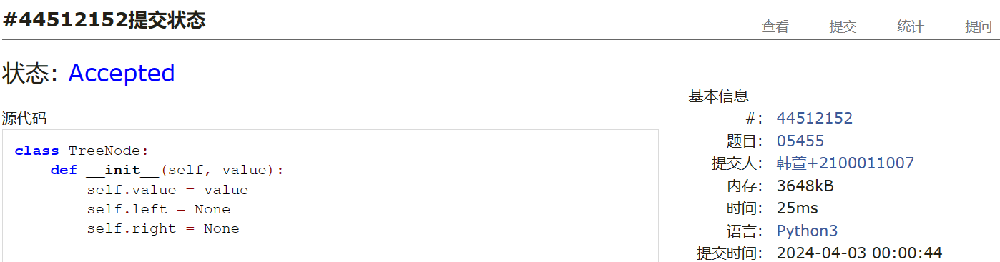
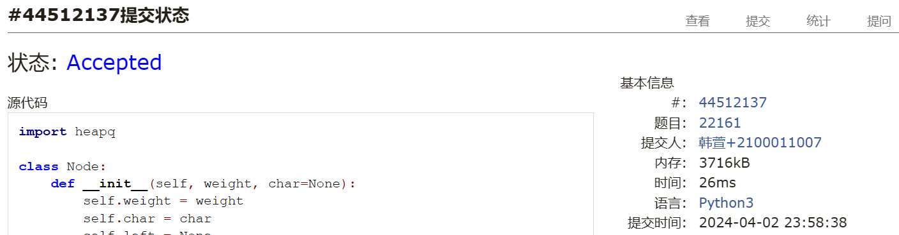
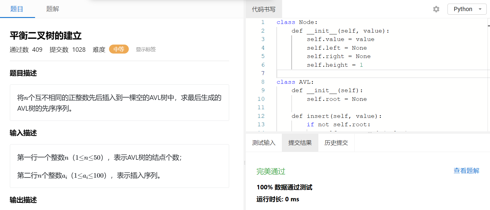
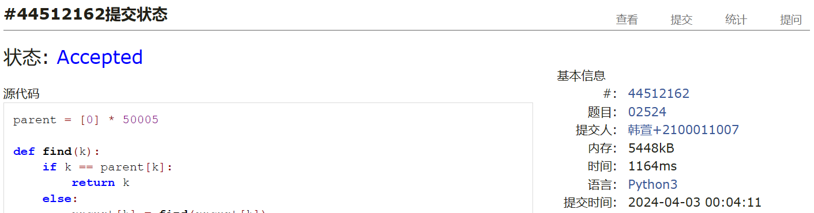

# Assignment #6: "树"算：Huffman,BinHeap,BST,AVL,DisjointSet

Updated 2214 GMT+8 March 24, 2024

2024 spring, Complied by ==同学的姓名、院系==


**说明：**

1）这次作业内容不简单，耗时长的话直接参考题解。

2）请把每个题目解题思路（可选），源码Python, 或者C++（已经在Codeforces/Openjudge上AC），截图（包含Accepted），填写到下面作业模版中（推荐使用 typora https://typoraio.cn ，或者用word）。AC 或者没有AC，都请标上每个题目大致花费时间。

3）提交时候先提交pdf文件，再把md或者doc文件上传到右侧“作业评论”。Canvas需要有同学清晰头像、提交文件有pdf、"作业评论"区有上传的md或者doc附件。

4）如果不能在截止前提交作业，请写明原因。


**编程环境**

==（请改为同学的操作系统、编程环境等）==

操作系统：macOS Ventura 13.4.1 (c)

Python编程环境：Spyder IDE 5.2.2, PyCharm 2023.1.4 (Professional Edition)

C/C++编程环境：Mac terminal vi (version 9.0.1424), g++/gcc (Apple clang version 14.0.3, clang-1403.0.22.14.1)


## 1. 题目

### 22275: 二叉搜索树的遍历

http://cs101.openjudge.cn/practice/22275/


思路：
王昊 光华管理学院。思路：
建树思路：数组第一个元素是根节点，紧跟着是小于根节点值的节点，在根节点左侧，直至遇到大于根节点值的节点，
后续节点都在根节点右侧，按照这个思路递归即可


代码

```python
class Node():
    def __init__(self, val):
        self.val = val
        self.left = None
        self.right = None


def buildTree(preorder):
    if len(preorder) == 0:
        return None

    node = Node(preorder[0])

    idx = len(preorder)
    for i in range(1, len(preorder)):
        if preorder[i] > preorder[0]:
            idx = i
            break
    node.left = buildTree(preorder[1:idx])
    node.right = buildTree(preorder[idx:])

    return node


def postorder(node):
    if node is None:
        return []
    output = []
    output.extend(postorder(node.left))
    output.extend(postorder(node.right))
    output.append(str(node.val))

    return output


n = int(input())
preorder = list(map(int, input().split()))
print(' '.join(postorder(buildTree(preorder))))
```


代码运行截图 ==（至少包含有"Accepted"）==



### 05455: 二叉搜索树的层次遍历

http://cs101.openjudge.cn/practice/05455/


思路：建树然后遍历即可


代码

```python
class TreeNode:
    def __init__(self, value):
        self.value = value
        self.left = None
        self.right = None

def insert(node, value):
    if node is None:
        return TreeNode(value)
    if value < node.value:
        node.left = insert(node.left, value)
    elif value > node.value:
        node.right = insert(node.right, value)
    return node

def level_order_traversal(root):
    queue = [root]
    traversal = []
    while queue:
        node = queue.pop(0)
        traversal.append(node.value)
        if node.left:
            queue.append(node.left)
        if node.right:
            queue.append(node.right)
    return traversal

numbers = list(map(int, input().strip().split()))
numbers = list(dict.fromkeys(numbers))  # remove duplicates
root = None
for number in numbers:
    root = insert(root, number)
traversal = level_order_traversal(root)
print(' '.join(map(str, traversal)))
```


代码运行截图 ==（至少包含有"Accepted"）==


### 04078: 实现堆结构

http://cs101.openjudge.cn/practice/04078/

练习自己写个BinHeap。当然机考时候，如果遇到这样题目，直接import heapq。手搓栈、队列、堆、AVL等，考试前需要搓个遍。


思路：就用的上课的实现方式


代码

```python
class BinHeap:
    def __init__(self):
        self.heapList = [0]
        self.currentSize = 0

    def percUp(self,i):
        while i // 2 > 0:
        if self.heapList[i] < self.heapList[i // 2]:
            tmp = self.heapList[i // 2]
            self.heapList[i // 2] = self.heapList[i]
            self.heapList[i] = tmp
        i = i // 2

    def percDown(self,i):
        while (i * 2) <= self.currentSize:
            mc = self.minChild(i)
            if self.heapList[i] > self.heapList[mc]:
                tmp = self.heapList[i]
                self.heapList[i] = self.heapList[mc]
                self.heapList[mc] = tmp
            i = mc

    def minChild(self,i):
        if i * 2 + 1 > self.currentSize:
            return i * 2
        else:
            if self.heapList[i*2] < self.heapList[i*2+1]:
                return i * 2
            else:
                return i * 2 + 1

    def delMin(self):
        retval = self.heapList[1]
        self.heapList[1] = self.heapList[self.currentSize]
        self.currentSize = self.currentSize - 1
        self.heapList.pop()
        self.percDown(1)
        return retval

n = int(input())
binheap = BinHeap()
for i in range(n):
    s = map(int, input().split())
    if s[0] ==  1:
        binheap.insert(s[1])
    else:
        print(binheap.delMin())

```


代码运行截图 ==（AC代码截图，至少包含有"Accepted"）==



### 22161: 哈夫曼编码树

http://cs101.openjudge.cn/practice/22161/


思路：node储存字符和权重，然后用优先队列建树，然后编码解码


代码

```python
import heapq

class Node:
    def __init__(self, weight, char=None):
        self.weight = weight
        self.char = char
        self.left = None
        self.right = None

    def __lt__(self, other):
        if self.weight == other.weight:
            return self.char < other.char
        return self.weight < other.weight

def build_huffman_tree(characters):
    heap = []
    for char, weight in characters.items():
        heapq.heappush(heap, Node(weight, char))

    while len(heap) > 1:
        left = heapq.heappop(heap)
        right = heapq.heappop(heap)
        #merged = Node(left.weight + right.weight) #note: 合并后，char 字段默认值是空
        merged = Node(left.weight + right.weight, min(left.char, right.char))
        merged.left = left
        merged.right = right
        heapq.heappush(heap, merged)

    return heap[0]

def encode_huffman_tree(root):
    codes = {}

    def traverse(node, code):
        #if node.char:
        if node.left is None and node.right is None:
            codes[node.char] = code
        else:
            traverse(node.left, code + '0')
            traverse(node.right, code + '1')

    traverse(root, '')
    return codes

def huffman_encoding(codes, string):
    encoded = ''
    for char in string:
        encoded += codes[char]
    return encoded

def huffman_decoding(root, encoded_string):
    decoded = ''
    node = root
    for bit in encoded_string:
        if bit == '0':
            node = node.left
        else:
            node = node.right

        #if node.char:
        if node.left is None and node.right is None:
            decoded += node.char
            node = root
    return decoded

# 读取输入
n = int(input())
characters = {}
for _ in range(n):
    char, weight = input().split()
    characters[char] = int(weight)

#string = input().strip()
#encoded_string = input().strip()

# 构建哈夫曼编码树
huffman_tree = build_huffman_tree(characters)

# 编码和解码
codes = encode_huffman_tree(huffman_tree)

strings = []
while True:
    try:
        line = input()
        strings.append(line)

    except EOFError:
        break

results = []
#print(strings)
for string in strings:
    if string[0] in ('0','1'):
        results.append(huffman_decoding(huffman_tree, string))
    else:
        results.append(huffman_encoding(codes, string))

for result in results:
    print(result)
```


代码运行截图 ==（AC代码截图，至少包含有"Accepted"）==


### 晴问9.5: 平衡二叉树的建立

https://sunnywhy.com/sfbj/9/5/359


思路：照讲义写的


代码

```python
class Node:
    def __init__(self, value):
        self.value = value
        self.left = None
        self.right = None
        self.height = 1

class AVL:
    def __init__(self):
        self.root = None

    def insert(self, value):
        if not self.root:
            self.root = Node(value)
        else:
            self.root = self._insert(value, self.root)

    def _insert(self, value, node):
        if not node:
            return Node(value)
        elif value < node.value:
            node.left = self._insert(value, node.left)
        else:
            node.right = self._insert(value, node.right)

        node.height = 1 + max(self._get_height(node.left), self._get_height(node.right))

        balance = self._get_balance(node)

        if balance > 1:
            if value < node.left.value:	# 树形是 LL
                return self._rotate_right(node)
            else:	# 树形是 LR
                node.left = self._rotate_left(node.left)
                return self._rotate_right(node)

        if balance < -1:
            if value > node.right.value:	# 树形是 RR
                return self._rotate_left(node)
            else:	# 树形是 RL
                node.right = self._rotate_right(node.right)
                return self._rotate_left(node)

        return node

    def _get_height(self, node):
        if not node:
            return 0
        return node.height

    def _get_balance(self, node):
        if not node:
            return 0
        return self._get_height(node.left) - self._get_height(node.right)

    def _rotate_left(self, z):
        y = z.right
        T2 = y.left
        y.left = z
        z.right = T2
        z.height = 1 + max(self._get_height(z.left), self._get_height(z.right))
        y.height = 1 + max(self._get_height(y.left), self._get_height(y.right))
        return y

    def _rotate_right(self, y):
        x = y.left
        T2 = x.right
        x.right = y
        y.left = T2
        y.height = 1 + max(self._get_height(y.left), self._get_height(y.right))
        x.height = 1 + max(self._get_height(x.left), self._get_height(x.right))
        return x

    def preorder(self):
        return self._preorder(self.root)

    def _preorder(self, node):
        if not node:
            return []
        return [node.value] + self._preorder(node.left) + self._preorder(node.right)

n = int(input().strip())
sequence = list(map(int, input().strip().split()))

avl = AVL()
for value in sequence:
    avl.insert(value)

print(' '.join(map(str, avl.preorder())))
```


代码运行截图 ==（AC代码截图，至少包含有"Accepted"）==



### 02524: 宗教信仰

http://cs101.openjudge.cn/practice/02524/


思路：并查集分类


代码

```python
parent = [0] * 50005

def find(k):
    if k == parent[k]:
        return k
    else:
        parent[k] = find(parent[k])
        return parent[k]

def unite(x, y):
    parent[find(x)] = find(y)

def main():
    case = 1
    while True:
        n, m = map(int, input().split())
        if n + m == 0:
            break
        res = 0
        for i in range(1, n+1):
            parent[i] = i
        for _ in range(m):
            a, b = map(int, input().split())
            unite(a, b)
        for i in range(1, n+1):
            if find(i) == i:
                res += 1
        print(f"Case {case}: {res}")
        case += 1

if __name__ == "__main__":
    main()
```


代码运行截图 ==（AC代码截图，至少包含有"Accepted"）==



## 2. 学习总结和收获

==如果作业题目简单，有否额外练习题目，比如：OJ“2024spring每日选做”、CF、LeetCode、洛谷等网站题目。==

这周作业太难了，大篇实现算法的函数，还得慢慢看慢慢学


