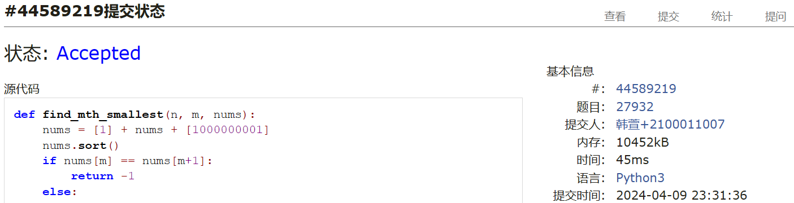

# Assignment #7: April 月考

Updated 1557 GMT+8 Apr 3, 2024

2024 spring, Complied by ==同学的姓名、院系==


**说明：**

1）请把每个题目解题思路（可选），源码Python, 或者C++（已经在Codeforces/Openjudge上AC），截图（包含Accepted），填写到下面作业模版中（推荐使用 typora https://typoraio.cn ，或者用word）。AC 或者没有AC，都请标上每个题目大致花费时间。

2）提交时候先提交pdf文件，再把md或者doc文件上传到右侧“作业评论”。Canvas需要有同学清晰头像、提交文件有pdf、"作业评论"区有上传的md或者doc附件。

3）如果不能在截止前提交作业，请写明原因。


**编程环境**

==（请改为同学的操作系统、编程环境等）==

操作系统：macOS Ventura 13.4.1 (c)

Python编程环境：Spyder IDE 5.2.2, PyCharm 2023.1.4 (Professional Edition)

C/C++编程环境：Mac terminal vi (version 9.0.1424), g++/gcc (Apple clang version 14.0.3, clang-1403.0.22.14.1)


## 1. 题目

### 27706: 逐词倒放

http://cs101.openjudge.cn/practice/27706/


思路：送分题


代码

```python
s = input().split()
s.reverse()
print(' '.join(s))
```


代码运行截图 ==（至少包含有"Accepted"）==


### 27951: 机器翻译

http://cs101.openjudge.cn/practice/27951/


思路：在这段代码中，我们首先创建了一个最大长度为M的队列memory来模拟内存。然后，我们遍历文章中的每个单词。如果单词不在内存中，我们就将其添加到内存，并增加查词典的次数。如果单词已经在内存中，我们就跳过它。最后，我们返回查词典的次数。

注意：这段代码使用了Python的collections.deque类，它是一个双端队列。当我们向一个已满的deque添加元素时，最早添加的元素会被自动移除。这正好符合这个问题的需求。


代码

```python
from collections import deque
m, n = map(int, input().split())
words = map(int, input().split())


def machine_translation(M, N, words):
    memory = deque(maxlen=M)
    lookup_count = 0

    for word in words:
        if word not in memory:
            memory.append(word)
            lookup_count += 1

    return lookup_count

print(machine_translation(m, n, words))
```


代码运行截图 ==（至少包含有"Accepted"）==


### 27932: Less or Equal

http://cs101.openjudge.cn/practice/27932/


思路：在这段Python代码中，我们首先将1和1000000001添加到数字列表的开头和末尾，然后对列表进行排序。然后，我们检查第m小的数是否等于第m+1小的数。如果等于，我们返回-1；否则，我们返回第m小的数。


代码

```python
def find_mth_smallest(n, m, nums):
    nums = [1] + nums + [1000000001]
    nums.sort()
    if nums[m] == nums[m+1]:
        return -1
    else:
        return nums[m]

n, m = map(int, input().split())
nums = list(map(int, input().split()))
print(find_mth_smallest(n, m, nums))
```


代码运行截图 ==（AC代码截图，至少包含有"Accepted"）==



### 27948: FBI树

http://cs101.openjudge.cn/practice/27948/


思路：己知二叉树的:“中序遍历+先序遍历”，或者“中序遍历+后序遍历”，都能确定一棵树。在这段Python代码中，我们首先定义了一个Node类来表示树的节点。然后，我们定义了一个build函数来构建树，和一个postorder函数来进行后序遍历。最后，我们从输入中读取数据，构建树，然后进行遍历。


代码

```python
class Node:
    def __init__(self, value='', left=None, right=None):
        self.value = value
        self.left = left
        self.right = right

def build(s, L, R):
    if L == R:
        return Node('I' if s[R] == '1' else 'B')
    mid = (L + R) // 2
    left = build(s, L, mid)
    right = build(s, mid + 1, R)
    if left.value == 'B' and right.value == 'B':
        return Node('B', left, right)
    elif left.value == 'I' and right.value == 'I':
        return Node('I', left, right)
    else:
        return Node('F', left, right)

def postorder(node):
    if node is not None:
        postorder(node.left)
        postorder(node.right)
        print(node.value, end='')

n = int(input())
s = [0] + list(input())
root = build(s, 1, len(s) - 1)
postorder(root)
```


代码运行截图 ==（AC代码截图，至少包含有"Accepted"）==


### 27925: 小组队列

http://cs101.openjudge.cn/practice/27925/


思路：本题要求实现一个小组队列，具体做法是给每个小组维护一个队列，另外再维护一个总的队列。总队列里只需排各个小组的编号，一旦有人新加入队列，首先判断此前其小组队列是否为空，是则将小组的编号加入总队列，再将此人加入小组队列即可；若其小组队列不为空，则直接加入小组队列即可。执行出队操作时，首先从总队列里取得队头小组的编号，并且将该小组队列队头元素出队，出队后一旦该小组队列为空，则同时将该小组队列的编号从总队列中出队。

思路十分简单，唯一要注意的是入队时要快速判断此人属于哪个小组，采用哈希表可解决。因为任意一个人的编号在一百万以内，所以在读入各小组成员时就可以构建哈希映射，便于后续入队时在O（1）时间内找到小组队列。


代码

```python
from collections import deque

def team_queue():
    global id
    q = [deque() for _ in range(t+1)]
    f = [0]*N
    for i in range(1, t+1):
        nums = list(map(int, input().split()))
        for x in nums:
            f[x] = i
    print(f"Scenario #{id}")
    id += 1
    while True:
        s = input().split()
        if s[0] == "STOP":
            break
        if s[0] == "ENQUEUE":
            x = int(s[1])
            if not q[f[x]]:
                q[0].append(f[x])
            q[f[x]].append(x)
        else:
            x = q[0][0]
            print(q[x][0])
            q[x].popleft()
            if not q[x]:
                q[0].popleft()
    print()

N = 1000000
T = 1006
id = 1
while True:
    t = int(input())
    if t == 0:
        break
    team_queue()
```


代码运行截图 ==（AC代码截图，至少包含有"Accepted"）==


### 27928: 遍历树

http://cs101.openjudge.cn/practice/27928/


思路：这个问题可以通过深度优先搜索（DFS）来解决。我们可以从根节点开始，然后对每个节点的子节点进行排序，然后递归地遍历每个子节点。


代码

```python
# 李思哲 物理学院
class TreeNode:
    def __init__(self, value):
        self.value = value
        self.children = []

def traverse_print(root, nodes):
    if root.children == []:
        print(root.value)
        return
    pac = {root.value: root}
    for child in root.children:
        pac[child] = nodes[child]
    for value in sorted(pac.keys()):
        if value in root.children:
            traverse_print(pac[value], nodes)
        else:
            print(root.value)

n = int(input())
nodes = {}
children_list = []
for i in range(n):
    info = list(map(int, input().split()))
    nodes[info[0]] = TreeNode(info[0])
    for child_value in info[1:]:
        nodes[info[0]].children.append(child_value)
        children_list.append(child_value)
root = nodes[[value for value in nodes.keys() if value not in children_list][0]]
traverse_print(root, nodes)
```


代码运行截图 ==（AC代码截图，至少包含有"Accepted"）==


## 2. 学习总结和收获

==如果作业题目简单，有否额外练习题目，比如：OJ“2024spring每日选做”、CF、LeetCode、洛谷等网站题目。==


