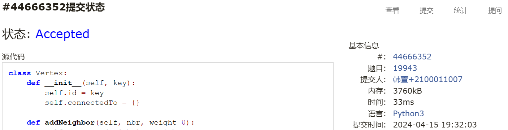
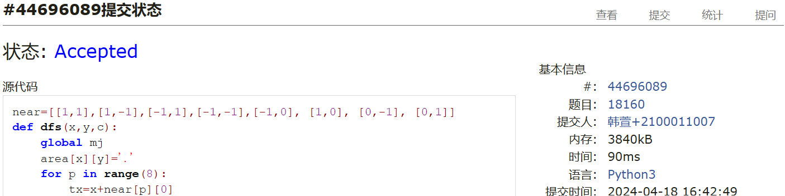
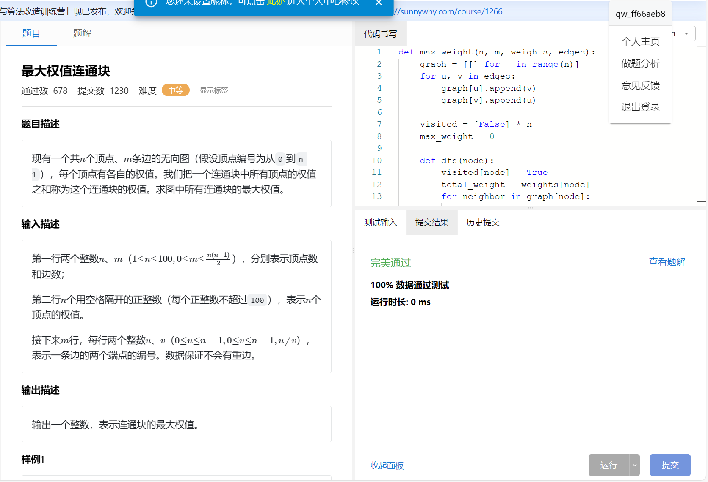
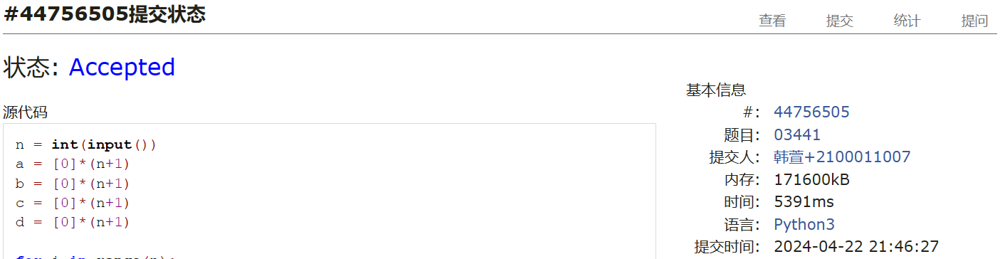
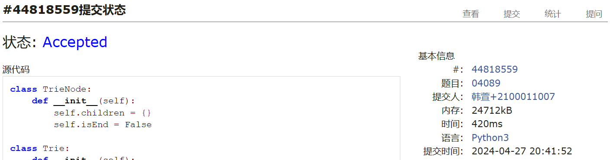
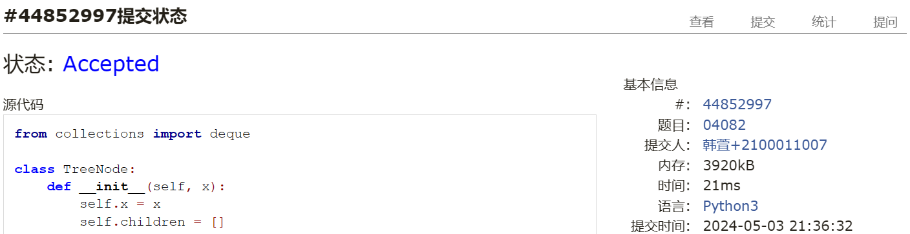

# Assignment #8: 图论：概念、遍历，及 树算

Updated 1919 GMT+8 Apr 8, 2024

2024 spring, Complied by ==同学的姓名、院系==


**说明：**

1）请把每个题目解题思路（可选），源码Python, 或者C++（已经在Codeforces/Openjudge上AC），截图（包含Accepted），填写到下面作业模版中（推荐使用 typora https://typoraio.cn ，或者用word）。AC 或者没有AC，都请标上每个题目大致花费时间。

2）提交时候先提交pdf文件，再把md或者doc文件上传到右侧“作业评论”。Canvas需要有同学清晰头像、提交文件有pdf、"作业评论"区有上传的md或者doc附件。

3）如果不能在截止前提交作业，请写明原因。


**编程环境**

==（请改为同学的操作系统、编程环境等）==

操作系统：macOS Ventura 13.4.1 (c)

Python编程环境：Spyder IDE 5.2.2, PyCharm 2023.1.4 (Professional Edition)

C/C++编程环境：Mac terminal vi (version 9.0.1424), g++/gcc (Apple clang version 14.0.3, clang-1403.0.22.14.1)


## 1. 题目

### 19943: 图的拉普拉斯矩阵

matrices, http://cs101.openjudge.cn/practice/19943/

请定义Vertex类，Graph类，然后实现


思路：套用vertex和graph类，构建拉普拉斯矩阵。


代码

```python
class Vertex:	
    def __init__(self, key):
        self.id = key
        self.connectedTo = {}

    def addNeighbor(self, nbr, weight=0):
        self.connectedTo[nbr] = weight

    def __str__(self):
        return str(self.id) + ' connectedTo: ' + str([x.id for x in self.connectedTo])

    def getConnections(self):
        return self.connectedTo.keys()

    def getId(self):
        return self.id

    def getWeight(self, nbr):
        return self.connectedTo[nbr]

class Graph:
    def __init__(self):
        self.vertList = {}
        self.numVertices = 0

    def addVertex(self, key):
        self.numVertices = self.numVertices + 1
        newVertex = Vertex(key)
        self.vertList[key] = newVertex
        return newVertex

    def getVertex(self, n):
        if n in self.vertList:
            return self.vertList[n]
        else:
            return None

    def __contains__(self, n):
        return n in self.vertList

    def addEdge(self, f, t, weight=0):
        if f not in self.vertList:
            nv = self.addVertex(f)
        if t not in self.vertList:
            nv = self.addVertex(t)
        self.vertList[f].addNeighbor(self.vertList[t], weight)

    def getVertices(self):
        return self.vertList.keys()

    def __iter__(self):
        return iter(self.vertList.values())

def constructLaplacianMatrix(n, edges):
    graph = Graph()
    for i in range(n):	# 添加顶点
        graph.addVertex(i)
    
    for edge in edges:	# 添加边
        a, b = edge
        graph.addEdge(a, b)
        graph.addEdge(b, a)
    
    laplacianMatrix = []	# 构建拉普拉斯矩阵
    for vertex in graph:
        row = [0] * n
        row[vertex.getId()] = len(vertex.getConnections())
        for neighbor in vertex.getConnections():
            row[neighbor.getId()] = -1
        laplacianMatrix.append(row)

    return laplacianMatrix


n, m = map(int, input().split())	# 解析输入
edges = []
for i in range(m):
    a, b = map(int, input().split())
    edges.append((a, b))

laplacianMatrix = constructLaplacianMatrix(n, edges)	# 构建拉普拉斯矩阵

for row in laplacianMatrix:	# 输出结果
    print(' '.join(map(str, row)))
```


代码运行截图 ==（至少包含有"Accepted"）==



### 18160: 最大连通域面积

matrix/dfs similar, http://cs101.openjudge.cn/practice/18160


思路：之前做过这个题，就是用dfs，相当于是把n*m的地方，所有为'W'的地方都找了一遍


代码

```python
near=[[1,1],[1,-1],[-1,1],[-1,-1],[-1,0], [1,0], [0,-1], [0,1]]
def dfs(x,y,c):
    global mj
    area[x][y]='.'
    for p in range(8):
        tx=x+near[p][0]
        ty=y+near[p][1]
        if area[tx][ty]==c:
            mj+=1
            dfs(tx,ty,c)
    return
    
T=int(input())
for _ in range(T):
    n,m=map(int,input().split())
    area= [['.' for _ in range(m+2)] for _ in range(n+2)] 
    for i in range(1, n+1): 
            area[i][1:-1] = input() 


    res=[0]
    for i in range(1,n+1):
        for j in range(1,m+1):
            if area[i][j]=='W':
                mj=1
                dfs(i,j,'W')
                res.append(mj)
                      
    print(max(res))
```


代码运行截图 ==（至少包含有"Accepted"）==



### sy383: 最大权值连通块

https://sunnywhy.com/sfbj/10/3/383


思路：因为是比较简单的无权图，只有结点有权，所以只需要用一个二维列表储存边，用一个一维列表weights储存结点权值就可以。然后每个结点都要dfs一遍，找到最大的权值和（其中通过visited来剪枝）


代码

```python
def max_weight(n, m, weights, edges):
    graph = [[] for _ in range(n)]
    for u, v in edges:
        graph[u].append(v)
        graph[v].append(u)

    visited = [False] * n
    max_weight = 0

    def dfs(node):
        visited[node] = True
        total_weight = weights[node]
        for neighbor in graph[node]:
            if not visited[neighbor]:
                total_weight += dfs(neighbor)
        return total_weight

    for i in range(n):
        if not visited[i]:
            max_weight = max(max_weight, dfs(i))

    return max_weight

# 接收数据
n, m = map(int, input().split())
weights = list(map(int, input().split()))
edges = []
for _ in range(m):
    u, v = map(int, input().split())
    edges.append((u, v))

# 调用函数
print(max_weight(n, m, weights, edges))
```


代码运行截图 ==（AC代码截图，至少包含有"Accepted"）==



### 03441: 4 Values whose Sum is 0

data structure/binary search, http://cs101.openjudge.cn/practice/03441


思路：之前就没看懂快速排序，这次仔细看了一下，发现这个算法真的太难看懂了！我差不多看了得有三个小时，来理解这个快速排序的算法，主要是partition函数那里指针的移动的内在逻辑，很难搞清楚，大部分教程都写的很非人类，感觉不像是能给人类看懂的。

这道题好像只能二分查找，因为如果是最简单的那就是四个for循环，所以就用二分吧。


利用dict实现，查找是O(1)，保证不超时。用两个dict记录a和b的和的组合数，还有c和d的和的组合数，结果空间爆了。只记录a和b之和的组合数，再遍历c和d之和的时候边检验是否有a和b之和的相反数，若有就加对应的组合数。
我自己试了一下这个方法，结果ac了，但是时间复杂度是O(n^2)，所以可能会超时。

```python
n = int(input())
a = [0]*(n+1)
b = [0]*(n+1)
c = [0]*(n+1)
d = [0]*(n+1)

for i in range(n):
    a[i],b[i],c[i],d[i] = map(int, input().split())

dict1 = {}
for i in range(n):
    for j in range(n):
        if not a[i]+b[j] in dict1:
            dict1[a[i] + b[j]] = 0
        dict1[a[i] + b[j]] += 1

ans = 0
for i in range(n):
    for j in range(n):
        if -(c[i]+d[j]) in dict1:
            ans += dict1[-(c[i]+d[j])]

print(ans)
```

```python
# https://docs.python.org/3/library/array.html
import array as arr

n = int(input())
a = arr.array('i', [0]*(n+1))
b = arr.array('i', [0]*(n+1))
c = arr.array('i', [0]*(n+1))
d = arr.array('i', [0]*(n+1))

for i in range(n):
    a[i],b[i],c[i],d[i] = map(int, input().split())


dict1 = {}
for i in range(n):
    for j in range(n):
        if not a[i]+b[j] in dict1:
            dict1[a[i] + b[j]] = 0
        dict1[a[i] + b[j]] += 1

ans = 0
for i in range(n):
    for j in range(n):
        if -(c[i]+d[j]) in dict1:#这一步是O(1)
            ans += dict1[-(c[i]+d[j])]

print(ans)
```


二分查找解题思路：在这本书的89页。《算法基础与在线实践》郭炜等编著，2017年。

​ 可以先考虑更简单的情况：给定两组整数a、b，求出和为0的二元组的个数。思路是：给定了两数之和为0，对a中每一个数a[i]，判断-a[i]是否在b中。这样问题就转化为了一个查找问题，可以使用二分查找加快查找的速度。首先对输入元素进行排序，从小到大枚举每一个元素a[i]，使用二分查找判断-a[i]是否在数组中，然后计算出现的次数。

​ 回到本题，面对四组整数之和的问题，可以将问题转化为两组整数的问题。首先枚举出a、b两组所有可能的和sum1，以及c、d两组所有可能的和sum2，将这两组和看成新的数组，然后利用上述思路，使用二分查找计算满足条件的二元组个数了。

​ 为了求出满足条件的二元组的个数，需要采用变形的二分查找，在有重复元素的数组中返回小于或等于目标的最大元素，若返回元素等于目标元素，则沿着数组计数该元素出现的次数这里采用左右都是闭区间的区间规则。若 targe ≤  mid，则 right = mid；若 targe > mid，则 left = mid + 1，两者都保证 left ≤  target ≤  right，并且在遇到重复的 target 时，right 会一直减少到第一次出现 target 的位置。循环终止条件为 left == right。

同学反馈，用Python，或者超时，或者爆内存。所以直接上C++。

```python
# https://stackoverflow.com/questions/2272819/sort-a-part-of-a-list-in-place
# 快速排序实现及其pivot的选取
# https://blog.csdn.net/qq_31903733/article/details/82945605
import random 

def quicksort(arr, start , stop): 
    if(start < stop): 
        pivotindex = partitionrand(arr, start, stop) 
        quicksort(arr , start , pivotindex - 1) 
        quicksort(arr, pivotindex + 1, stop) 

def partitionrand(arr , start, stop): 
    randpivot = random.randrange(start, stop) 
    arr[start], arr[randpivot] = arr[randpivot], arr[start] 
    return partition(arr, start, stop) 

def partition(arr,start,stop): 
    pivot = start # pivot 
    i = start + 1 # a variable to memorize where the  
                  # partition in the array starts from. 
    for j in range(start + 1, stop + 1): 
        if arr[j] <= arr[pivot]: 
            arr[i] , arr[j] = arr[j] , arr[i] 
            i = i + 1
    arr[pivot] , arr[i - 1] = arr[i - 1] , arr[pivot] 
    pivot = i - 1
    return (pivot) 
# end quicksort


#二分查找的算法也总是很难理解，主要是边界条件那里(mid是取left和right//2也就是下整数)。总结一下二分查找就是，输入一个要查找的数target，然后返回这个数的位置，感觉要自己写出来这个算法还是很难的，哎，还是学艺不精啊
def BinarySearch(target):
    num = 0
    left = 0
    global t
    right = t - 1
    while left < right:
        mid = (left + right)//2
        if target <= sumr2[mid]:
            right = mid
        else:
            left = mid + 1
    
    while(sumr2[left]==target and left<t):    # left<t 防止越界
        num += 1
        left += 1
    
    return num


n = int(input())
a = [0]*(n+1)
b = [0]*(n+1)
c = [0]*(n+1)
d = [0]*(n+1)

# https://docs.python.org/3/library/array.html
import array as arr
sumr1 = arr.array('i', [])
sumr2 = arr.array('i', [])

for i in range(n):
    a[i],b[i],c[i],d[i] = map(int, input().split())

t = 0
for i in range(n):
    for j in range(n):
        sumr1.append( a[i] + b[j] )#里面可能会有一些重复的元素，但是quicksort之后保留了这些重复的元素
        sumr2.append( c[i] + d[j] )
        t += 1

quicksort(sumr1, 0, t-1)
quicksort(sumr2, 0, t-1)

ans = 0
for i in range(t):
    ans += BinarySearch( -sumr1[i] )#在sumr2里面找-sumr1[i]的个数

print(ans)
#呃但是最后这个在oj上面超时了
```


代码运行截图 ==（AC代码截图，至少包含有"Accepted"）==

这个是字典的解法


### 04089: 电话号码

trie, http://cs101.openjudge.cn/practice/04089/

Trie 数据结构可能需要自学下。


思路：trie就是字典树，用来存储字符串的数据结构，可以用来快速查找字符串。这道题就是用trie来存储电话号码，然后查找电话号码的前缀。
用trie的做法一直wa，所以借鉴了答案。
最后发现是因为没有考虑911,911同时出现也算NO的这种情况，改了一下即可，其实也不必须要排序


代码

```python
class TrieNode:
    def __init__(self):
        self.children = {}
        self.isEnd = False

class Trie:
    def __init__(self):
        self.root = TrieNode()

    def insert(self, word):
        node = self.root
        for char in word:
            if char not in node.children:
                node.children[char] = TrieNode()
            node = node.children[char]
        if node.isEnd:
            return False
        node.isEnd = True
        return True

    def search(self, word):
        node = self.root
        for char in word:
            if char not in node.children:
                return False
            node = node.children[char]
        return node

t = int(input())
for i in range(t):
    n = int(input())
    trie = Trie()
    phones = []
    flag = 0
    for j in range(n):
        phone = input()
        phones.append(phone)
        if trie.insert(phone) == False:
            flag = 1
    for phone in phones:
        if trie.search(phone).children != {}:
            flag = 1
            break
    if flag == 1:
        print("NO")
    else:
        print("YES")

```


代码运行截图 ==（AC代码截图，至少包含有"Accepted"）==



### 04082: 树的镜面映射

http://cs101.openjudge.cn/practice/04082/


思路：这个题第一眼看实在是没什么想法，因为除了先用树的数据结构重构树，别的方法我也想不到了，但是重构树的话，我不知道怎么可以把二叉树转化为树，然后再把树镜面反射，所以我就看题解了。
print_tree用栈实现镜面反射效果的那块，确实想不到
这个题目有三点：
1. 把伪满二叉树变为二叉树
2. 把二叉树变为树
3. 把树镜面反射

把二叉树变成树之前只知道怎么在纸上做，没写过代码，步骤就是左儿子右兄弟

build_tree真的很难看懂，第一次看这种递归建树的代码


代码
```python
from collections import deque

class TreeNode:
    def __init__(self, x):
        self.x = x
        self.children = []

def create_node():
    return TreeNode('')

def build_tree(tempList, index):
    # 创建一个新的节点
    node = create_node()
    # 设置节点的值
    node.x = tempList[index][0]
    # 如果当前节点的第二个值为'0'，说明它有子节点
    if tempList[index][1] == '0':
        # 递归构建左子节点，并更新索引
        index += 1
        child, index = build_tree(tempList, index)
        # 将左子节点添加到当前节点的children列表中
        node.children.append(child)
        # 递归构建右子节点，并更新索引
        index += 1
        child, index = build_tree(tempList, index)
        # 将右子节点添加到当前节点的children列表中
        node.children.append(child)
    # 返回当前节点和索引
    return node, index


#这里没用重新建一个树，而是利用右儿子是兄弟的特性，直接找到一层的原树的兄弟，这个顺序是从root开始，从上往下的
def print_tree(p):
    Q = deque()
    s = deque()

    # 遍历右子节点并将非虚节点加入栈s
    while p is not None:
        if p.x != '$':
            s.append(p)
        p = p.children[1] if len(p.children) > 1 else None #如果节点p有超过一个子节点（也就是说，它有右子节点），那么p就被设置为它的右子节点（p.children[1]）。否则，如果节点p没有右子节点，那么p就被设置为None。

    # 将栈s中的节点逆序放入队列Q
    while s:
        Q.append(s.pop())

    # 宽度优先遍历队列Q并打印节点值
    while Q:
        p = Q.popleft()
        print(p.x, end=' ')

        # 如果节点有左子节点，将左子节点及其右子节点加入栈s
        if p.children:
            p = p.children[0]
            ############################这部分和上面一样
            while p is not None:
                if p.x != '$':
                    s.append(p)
                p = p.children[1] if len(p.children) > 1 else None
            ############################

            # 将栈s中的节点逆序放入队列Q
            while s:
                Q.append(s.pop())


n = int(input())
tempList = input().split()

# 构建多叉树
root, _ = build_tree(tempList, 0)

# 执行宽度优先遍历并打印镜像映射序列
print_tree(root)
```


代码运行截图 ==（AC代码截图，至少包含有"Accepted"）==



## 2. 学习总结和收获

==如果作业题目简单，有否额外练习题目，比如：OJ“2024spring每日选做”、CF、LeetCode、洛谷等网站题目。==
哎，最后一题实在是太难了，每个点都是难点感觉，具体的体会我都写成注释穿插在代码里面了，这下对树的认识又狠狠加深了


