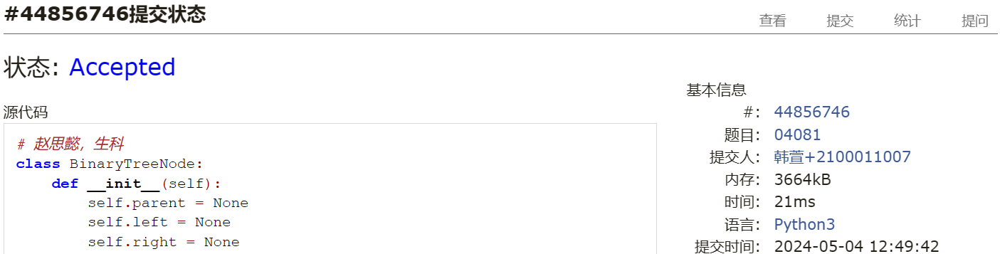
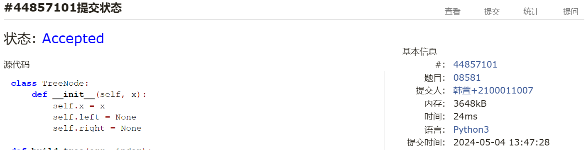
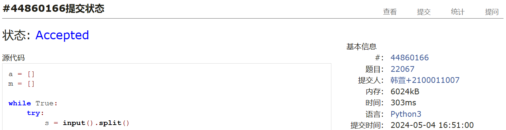
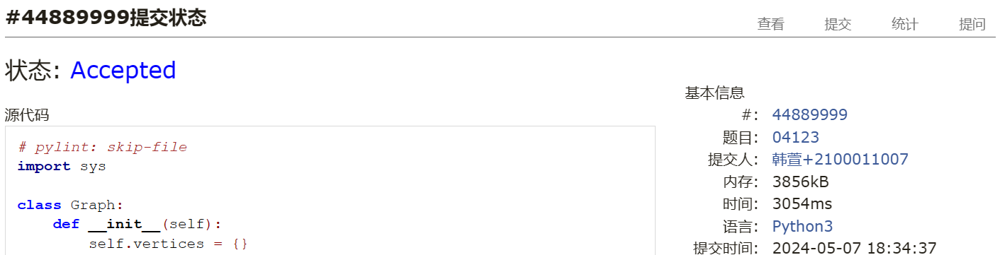
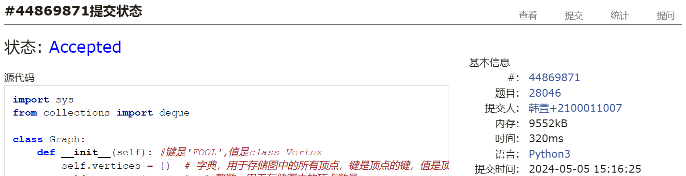
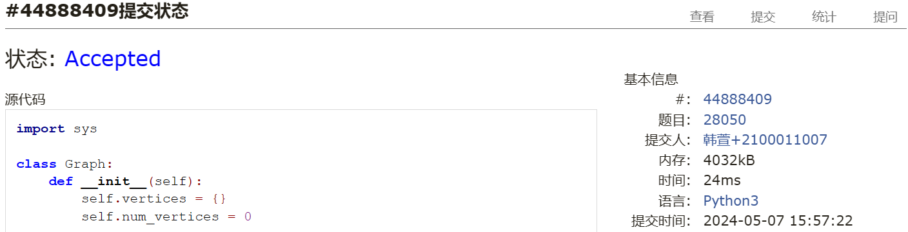
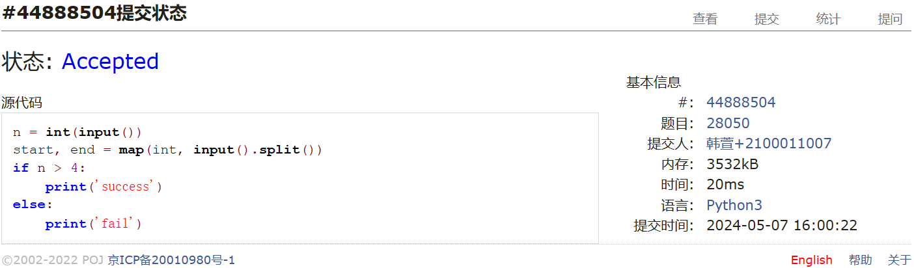

# Assignment #9: 图论：遍历，及 树算

Updated 1739 GMT+8 Apr 14, 2024

2024 spring, Complied by ==同学的姓名、院系==


**说明：**

1）请把每个题目解题思路（可选），源码Python, 或者C++（已经在Codeforces/Openjudge上AC），截图（包含Accepted），填写到下面作业模版中（推荐使用 typora https://typoraio.cn ，或者用word）。AC 或者没有AC，都请标上每个题目大致花费时间。

2）提交时候先提交pdf文件，再把md或者doc文件上传到右侧“作业评论”。Canvas需要有同学清晰头像、提交文件有pdf、"作业评论"区有上传的md或者doc附件。

3）如果不能在截止前提交作业，请写明原因。


**编程环境**

==（请改为同学的操作系统、编程环境等）==

操作系统：macOS Ventura 13.4.1 (c)

Python编程环境：Spyder IDE 5.2.2, PyCharm 2023.1.4 (Professional Edition)

C/C++编程环境：Mac terminal vi (version 9.0.1424), g++/gcc (Apple clang version 14.0.3, clang-1403.0.22.14.1)


## 1. 题目

### 04081: 树的转换

http://cs101.openjudge.cn/dsapre/04081/


思路：第八次作业的最后一题就是这个，刚好复习一下。直接看看不出有什么方便的数学方法，所以就手搓树了。
树转换为二叉树的规则是，左儿子右兄弟。
因为不确定思路对不对，所以偷看一下题解是什么方法
好的，确定思路为：
1. 建树
2. 树转二叉树
3. bfs找最长路径
后来发现，好像不用建树，直接树转二叉树就可以了
再后来看了一圈大家的题解，有递归建树的，有代码特别短看不懂但很简洁的，有用stack的，真是各显神通。。。
把ud转换为x，和用stack的这两种方法我是真没想到，都贴在这里吧，拜读一下。。。唉我怎么自己就想不到呢
太妙了，想不到根本想不到

代码

```python
# 赵思懿，生科
class BinaryTreeNode:
    def __init__(self):
        self.parent = None
        self.left = None
        self.right = None

def tree_height(root):  # 计算二叉树高度
    if not root:
        return -1
    else:
        return max(tree_height(root.left), tree_height(root.right)) + 1 #用递归

def original_tree_height(arr):  # 原树高度
    height, max_height = 0, 0
    for action in arr:
        if action == 'd':
            height += 1
        elif action == 'u':
            height -= 1
        max_height = max(max_height, height) #更新最大高度
    return max_height

def build_binary_tree(arr):  # 根据输入序列建立二叉树
    root = BinaryTreeNode()  # 创建根节点
    current_node = root  # 设置当前节点为根节点
    for action in arr:  # 遍历输入序列
        if action == 'd':  # 如果动作是'd'，向下创建左子节点
            current_node.left = BinaryTreeNode()  # 创建左子节点
            current_node.left.parent = current_node  # 设置左子节点的父节点为当前节点
            current_node = current_node.left  # 将当前节点设置为左子节点
        elif action == 'x':  # 如果动作是'x'，向右创建右子节点
            current_node.right = BinaryTreeNode()  # 创建右子节点
            current_node.right.parent = current_node.parent  # 设置右子节点的父节点为当前节点的父节点
            current_node = current_node.right  # 将当前节点设置为右子节点
        elif action == 'u':  # 如果动作是'u'，向上回到父节点
            current_node = current_node.parent  # 将当前节点设置为其父节点
    return root  # 返回根节点

input_sequence = input().replace('ud', 'x')
binary_tree_root = build_binary_tree(input_sequence)
print(original_tree_height(input_sequence), '=>', tree_height(binary_tree_root))
```

```python
# 23n2300011072(X)
class TreeNode:
    def __init__(self):
        self.children = []
        self.first_child = None
        self.next_sib = None


def build(seq):
    root = TreeNode()
    stack = [root]
    depth = 0
    for act in seq:
        cur_node = stack[-1]
        if act == 'd':
            new_node = TreeNode()
            if not cur_node.children:
                cur_node.first_child = new_node
            else:
                cur_node.children[-1].next_sib = new_node
            cur_node.children.append(new_node)
            stack.append(new_node)
            depth = max(depth, len(stack) - 1)
        else:
            stack.pop()
    return root, depth


def cal_h_bin(node):
    if not node:
         return -1
    return max(cal_h_bin(node.first_child), cal_h_bin(node.next_sib)) + 1


seq = input()
root, h_orig = build(seq)
h_bin = cal_h_bin(root)
print(f'{h_orig} => {h_bin}')

```

思路：我写的方法还是分别建起来两个树，其中左儿子右兄弟方法建树还挺麻烦的，但是后来一想，每一个节点都是左儿子右兄弟方法建树，那不就是递归吗。

```python
# 蔡嘉华 物理学院
class TreeNode:
    def __init__(self):
        self.children = []
        self.left = None
        self.right = None

def height1(root):
    if not root:
        return -1
    elif not root.children:
        return 0
    h = 0
    for child in root.children:
        h = max(h, height1(child))
    return h + 1

def height2(root):
    if not root:
        return -1
    elif not root.left and not root.right:
        return 0
    return 1 + max(height2(root.left), height2(root.right))

root = TreeNode()
nodes = [root]
steps = list(input())
for step in steps:
    if step == 'd':
        node = TreeNode()
        nodes[-1].children.append(node)
        nodes.append(node)
    else:
        nodes.pop()

def prase_tree(root: TreeNode):
    if root.children:
        root.left = prase_tree(root.children.pop(0)) #从左边弹出一个节点
        cur = root.left
        while root.children:
            cur.right = prase_tree(root.children.pop(0))
            cur = cur.right
    return root
#我就是在这里卡住了，一直想不到怎么转换成二叉树，原来还是递归！

h1 = height1(root)
root0 = prase_tree(root)
h2 = height2(root0)
print(f'{h1} => {h2}')
```


代码运行截图 ==（至少包含有"Accepted"）==



### 08581: 扩展二叉树

http://cs101.openjudge.cn/dsapre/08581/


思路：我没看题解，但我估计这个题还是递归建树的思想，我先试试吧。感觉可以参考一下之前index+=1，补充'$'然后递归建树的那个题的思路。
顺便，题目没有说清楚，我查了一下，一个子节点的node也要扩展一个'.'使得他有两个子节点
一遍AC太爽了哈哈哈！我甚至都没在本地跑，写完直接提交


代码

```python
class TreeNode:
    def __init__(self, x):
        self.x = x
        self.left = None
        self.right = None

def build_tree(arr, index):
    if arr[index] == '.':
        return None, index
    node = TreeNode(arr[index])
    index += 1
    node.left, index = build_tree(arr, index)
    index += 1
    node.right, index = build_tree(arr, index)
    return node, index

def postorder_traversal(root):
    if root is None:
        return ''
    return postorder_traversal(root.left) + postorder_traversal(root.right) + root.x

def midorder_traversal(root):
    if root is None:
        return ''
    return midorder_traversal(root.left) + root.x + midorder_traversal(root.right)

arr = input()
root, _ = build_tree(arr, 0)
print(midorder_traversal(root))
print(postorder_traversal(root))
```


代码运行截图 ==（至少包含有"Accepted"）==



### 22067: 快速堆猪

http://cs101.openjudge.cn/practice/22067/


思路：guowei，那这应该就是考数据结构的问题，要降低时间复杂度，push和pop可以用deque，查找最小元素呢？噢可以用两个数据结构，一个是deque，一个是minheap，这样就可以了。我先试试吧。后来发现好像不行，因为pop的时候，heap出来的是一个最小元素，但是deque出来的是顶端元素。
好吧那我看看题解是怎么做的
懒惰删除这个概念第一次知道
题解这个代码我也看了想了挺久的，感觉不是很容易明白
唉现在看明白了，可以理解为m和a的长度是一样变化的，m的最后一个元素是a中最小的元素，这样就可以了


代码

用辅助栈：用一个单调栈维护最小值，再用另外一个栈维护其余的值。

每次push时，在辅助栈中加入当前最轻的猪的体重，pop时也同步pop，这样栈顶始终是当前猪堆中最轻的体重，查询时直接输出即可

```python
a = []
m = []

while True:
    try:
        s = input().split()
    
        if s[0] == "pop":
            if a:
                a.pop()
                if m:
                    m.pop()
        elif s[0] == "min":
            if m:
                print(m[-1])
        else:
            h = int(s[1])
            a.append(h)
            if not m:
                m.append(h)
            else:
                k = m[-1]
                m.append(min(k, h))
    except EOFError:
        break
```


代码运行截图 ==（AC代码截图，至少包含有"Accepted"）==



### 04123: 马走日

dfs, http://cs101.openjudge.cn/practice/04123


思路：改一下骑士周游代码，发现不完全一样，于是又读了一下计概当时ac的代码，对比思考了一下骑士周游的代码

```python
maxn = 10
sx = [-2,-1,1,2,2,1,-1,-2]
sy = [1,2,2,1,-1,-2,-2,-1]

ans=0

def dfs(dep:int,x:int,y:int):
    global ans
    #是否已经全部走完
    if n*m == dep:
        ans+=1
        return
    
    #对于每一个可以走的点
    for r in range(8):
        s = x + sx[r]
        t = y + sy[r]
        if chess[s][t]==False and 0<=s<n and 0<=t<m:
            chess[s][t]=True
            dfs(dep+1,s,t)
            chess[s][t]=False#回溯
    return
            
for _ in range(int(input())):
    n,m,x,y = map(int,input().split())
    chess = [[False]*maxn for _ in range(maxn)]#False表示没有走过
    ans = 0
    chess[x][y] = True
    dfs(1,x,y)
    print(ans)

```
区别在于
1. 在
```python
knight_tour(n + 1, path, nbr, limit)
```
之后把这个nbr重新标记回白色，因为我还想探索经过这个nbr其他的可能性。
2. dfs完nbr之后，不要回溯，不要回溯，不要回溯！不然第一次return True之后，就回一直回溯到第一层函数了，这样就不对了

代码

```python
# pylint: skip-file
import sys

class Graph:
    def __init__(self):
        self.vertices = {}
        self.num_vertices = 0

    def add_vertex(self, key):
        self.num_vertices = self.num_vertices + 1
        new_ertex = Vertex(key)
        self.vertices[key] = new_ertex
        return new_ertex

    def get_vertex(self, n):
        if n in self.vertices:
            return self.vertices[n]
        else:
            return None

    def __len__(self):
        return self.num_vertices

    def __contains__(self, n):
        return n in self.vertices

    def add_edge(self, f, t, cost=0):
        if f not in self.vertices:
            nv = self.add_vertex(f)
        if t not in self.vertices:
            nv = self.add_vertex(t)
        self.vertices[f].add_neighbor(self.vertices[t], cost)
        #self.vertices[t].add_neighbor(self.vertices[f], cost)

    def getVertices(self):
        return list(self.vertices.keys())

    def __iter__(self):
        return iter(self.vertices.values())


class Vertex:
    def __init__(self, num):
        self.key = num
        self.connectedTo = {}
        self.color = 'white'
        self.distance = sys.maxsize
        self.previous = None
        self.disc = 0
        self.fin = 0

    def __lt__(self,o):
        return self.key < o.key

    def add_neighbor(self, nbr, weight=0):
        self.connectedTo[nbr] = weight


    # def setDiscovery(self, dtime):
    #     self.disc = dtime
    #
    # def setFinish(self, ftime):
    #     self.fin = ftime
    #
    # def getFinish(self):
    #     return self.fin
    #
    # def getDiscovery(self):
    #     return self.disc

    def get_neighbors(self):
        return self.connectedTo.keys()

    # def getWeight(self, nbr):
    #     return self.connectedTo[nbr]

    def __str__(self):
        return str(self.key) + ":color " + self.color + ":disc " + str(self.disc) + ":fin " + str(
            self.fin) + ":dist " + str(self.distance) + ":pred \n\t[" + str(self.previous) + "]\n"


def knight_graph(n,m):
    kt_graph = Graph()
    for row in range(n):           #遍历每一行
        for col in range(m):       #遍历行上的每一个格子
            node_id = pos_to_node_id(row, col, n, m) #把行、列号转为格子ID
            new_positions = gen_legal_moves(row, col, n, m) #按照 马走日，返回下一步可能位置
            for row2, col2 in new_positions:
                other_node_id = pos_to_node_id(row2, col2, n, m) #下一步的格子ID
                kt_graph.add_edge(node_id, other_node_id) #在骑士周游图中为两个格子加一条边
    return kt_graph

def pos_to_node_id(x, y, n, m):
    return x * m + y

def gen_legal_moves(row, col, n, m):
    new_moves = []
    move_offsets = [                        # 马走日的8种走法
        (-1, -2),  # left-down-down
        (-1, 2),  # left-up-up
        (-2, -1),  # left-left-down
        (-2, 1),  # left-left-up
        (1, -2),  # right-down-down
        (1, 2),  # right-up-up
        (2, -1),  # right-right-down
        (2, 1),  # right-right-up
    ]
    for r_off, c_off in move_offsets:
        if (                                # #检查，不能走出棋盘
            0 <= row + r_off < n
            and 0 <= col + c_off < m
        ):
            new_moves.append((row + r_off, col + c_off))
    return new_moves

# def legal_coord(row, col, board_size):
#     return 0 <= row < board_size and 0 <= col < board_size


def knight_tour(n, path, u, limit):
    global ans
    u.color = "gray"
    path.append(u)              #当前顶点涂色并加入路径
    if n < limit:
        neighbors = ordered_by_avail(u) #对所有的合法移动依次深入
        #neighbors = sorted(list(u.get_neighbors()))
        i = 0

        for nbr in neighbors:
            if nbr.color == "white" and \
                knight_tour(n + 1, path, nbr, limit):   #选择“白色”未经深入的点，层次加一，递归深入
                nbr.color = "white" #之后把这个nbr重新标记回白色，因为我还想探索经过这个nbr其他的可能性。dfs完nbr之后，不要回溯，不要回溯，不要回溯！不然第一次return True之后，就回一直回溯到第一层函数了，这样就不对了
        else:                       #所有的“下一步”都试了走不通
            path.pop()              #回溯，从路径中删除当前顶点
            u.color = "white"       #当前顶点改回白色
            return False
    else:
        u.color = "white"
        ans += 1
        return True
    

def ordered_by_avail(n):
    res_list = []
    for v in n.get_neighbors():
        if v.color == "white":
            c = 0
            for w in v.get_neighbors():
                if w.color == "white":
                    c += 1
            res_list.append((c,v))
    res_list.sort(key = lambda x: x[0])
    return [y[1] for y in res_list]

# class DFSGraph(Graph):
#     def __init__(self):
#         super().__init__()
#         self.time = 0                   #不是物理世界，而是算法执行步数
#
#     def dfs(self):
#         for vertex in self:
#             vertex.color = "white"      #颜色初始化
#             vertex.previous = -1
#         for vertex in self:             #从每个顶点开始遍历
#             if vertex.color == "white":
#                 self.dfs_visit(vertex)  #第一次运行后还有未包括的顶点
#                                         # 则建立森林
#
#     def dfs_visit(self, start_vertex):
#         start_vertex.color = "gray"
#         self.time = self.time + 1       #记录算法的步骤
#         start_vertex.discovery_time = self.time
#         for next_vertex in start_vertex.get_neighbors():
#             if next_vertex.color == "white":
#                 next_vertex.previous = start_vertex
#                 self.dfs_visit(next_vertex)     #深度优先递归访问
#         start_vertex.color = "black"
#         self.time = self.time + 1
#         start_vertex.closing_time = self.time


def main():
    global ans
    T = int(input())
    for i in range(T):
        ans = 0
        n, m, x, y = map(int, input().split())
        g = knight_graph(n, m)
        start_vertex = g.get_vertex(pos_to_node_id(x, y, n, m))
        path = []
        knight_tour(0, path, start_vertex, n * m - 1)
        print(ans)


if __name__ == "__main__":
    main()
    
```


代码运行截图 ==（AC代码截图，至少包含有"Accepted"）==



### 28046: 词梯

bfs, http://cs101.openjudge.cn/practice/28046/


思路：讲义里面的，我自己加了点注释辅助理解，把建图部分改一下就好，不是读取txt文件了


代码

```python
import sys
from collections import deque

class Graph:
    def __init__(self): #键是'FOOL',值是class Vertex
        self.vertices = {}  # 字典，用于存储图中的所有顶点，键是顶点的键，值是顶点对象
        self.num_vertices = 0  # 整数，用于存储图中的顶点数量

    def add_vertex(self, key):
        self.num_vertices = self.num_vertices + 1  # 顶点数量加1
        new_vertex = Vertex(key)  # 创建一个新的顶点
        self.vertices[key] = new_vertex  # 将新的顶点添加到字典中
        return new_vertex  # 返回新的顶点

    def get_vertex(self, n):
        if n in self.vertices:  # 如果n是字典的键
            return self.vertices[n]  # 返回键为n的顶点
        else:
            return None  # 否则，返回None

    def __len__(self):
        return self.num_vertices  # 返回图中的顶点数量

    def __contains__(self, n):
        return n in self.vertices  # 检查n是否是字典的键，即检查n是否是图中的一个顶点

    def add_edge(self, f, t, cost=0):
        if f not in self.vertices:  # 如果f不是图中的一个顶点
            nv = self.add_vertex(f)  # 添加一个新的顶点f
        if t not in self.vertices:  # 如果t不是图中的一个顶点
            nv = self.add_vertex(t)  # 添加一个新的顶点t
        self.vertices[f].add_neighbor(self.vertices[t], cost)  # 在顶点f和顶点t之间添加一条边，边的权重是cost

    def get_vertices(self):
        return list(self.vertices.keys())

    def __iter__(self):
        return iter(self.vertices.values())


class Vertex: 
    def __init__(self, num):
        self.key = num  # 顶点的键
        self.connectedTo = {}  # 字典，用于存储与这个顶点相连的其他顶点及其权重
        self.color = 'white'  # 顶点的颜色，用于图的搜索和遍历
        self.distance = sys.maxsize  # 顶点的距离，用于图的搜索和遍历
        self.previous = None  # 顶点的前一个顶点，用于图的搜索和遍历
        self.disc = 0  # 顶点的发现时间，用于图的搜索和遍历
        self.fin = 0  # 顶点的完成时间，用于图的搜索和遍历

    def add_neighbor(self, nbr, weight=0):
        self.connectedTo[nbr] = weight  # 添加一个邻居顶点，nbr是邻居顶点，weight是从这个顶点到邻居顶点的边的权重

    # def __lt__(self,o):
    #     return self.id < o.id  # 比较两个顶点，这个方法被注释掉了，所以在当前的Vertex类中并没有被使用

    # def setDiscovery(self, dtime):
    #     self.disc = dtime  # 设置顶点的发现时间，这个方法被注释掉了，所以在当前的Vertex类中并没有被使用

    # def setFinish(self, ftime):
    #     self.fin = ftime  # 设置顶点的完成时间，这个方法被注释掉了，所以在当前的Vertex类中并没有被使用
    #
    # def getFinish(self):
    #     return self.fin
    #
    # def getDiscovery(self):
    #     return self.disc

    def get_neighbors(self):
        return self.connectedTo.keys()

    # def getWeight(self, nbr):
    #     return self.connectedTo[nbr]

    # def __str__(self):
    #     return str(self.key) + ":color " + self.color + ":disc " + str(self.disc) + ":fin " + str(
    #         self.fin) + ":dist " + str(self.distance) + ":pred \n\t[" + str(self.previous) + "]\n"


def build_graph(namelist):
    buckets = {}
    the_graph = Graph()
    all_words = namelist
    # all_words = ["bane", "bank", "bunk", "cane", "dale", "dunk", "foil", "fool", "kale",
    #              "lane", "male", "mane", "pale", "pole", "poll", "pool", "quip",
    #              "quit", "rain", "sage", "sale", "same", "tank", "vain", "wane"
    #              ]

    # create buckets of words that differ by 1 letter
    for line in all_words:
        word = line.strip()
        for i, _ in enumerate(word):
            bucket = f"{word[:i]}_{word[i + 1:]}"
            buckets.setdefault(bucket, set()).add(word)  # 在字典buckets中添加键值对。如果bucket不是字典的键，就添加一个新的键bucket，值是一个空的集合。然后，将word添加到键为bucket的集合中。

    # connect different words in the same bucket
    # 这个程序有个bug，他不能把孤立的单词加入到图中，所以我们需要手动添加————韩萱
    for similar_words in buckets.values():
        if len(similar_words) > 1:
            for word1 in similar_words:
                for word2 in similar_words - {word1}:
                    the_graph.add_edge(word1, word2)
        else:
            if list(similar_words)[0] not in the_graph.get_vertices():
                the_graph.add_vertex(list(similar_words)[0])

    return the_graph


n = int(input())
namelist = []
for i in range(n):
    namelist.append(input())
g = build_graph(namelist)


def bfs(start):
    start.distance = 0
    start.previous = None
    vert_queue = deque()
    vert_queue.append(start)
    while len(vert_queue) > 0:
        current = vert_queue.popleft()  # 取队首作为当前顶点
        for neighbor in current.get_neighbors():   # 遍历当前顶点的邻接顶点
            if neighbor.color == "white":
                neighbor.color = "gray"
                neighbor.distance = current.distance + 1
                neighbor.previous = current
                vert_queue.append(neighbor)
        current.color = "black" # 当前顶点已经处理完毕，设黑色

"""
BFS 算法主体是两个循环的嵌套: while-for
    while 循环对图中每个顶点访问一次，所以是 O(|V|)；
    嵌套在 while 中的 for，由于每条边只有在其起始顶点u出队的时候才会被检查一次，
    而每个顶点最多出队1次，所以边最多被检查次，一共是 O(|E|)；
    综合起来 BFS 的时间复杂度为 0(V+|E|)

词梯问题还包括两个部分算法
    建立 BFS 树之后，回溯顶点到起始顶点的过程，最多为 O(|V|)
    创建单词关系图也需要时间，时间是 O(|V|+|E|) 的，因为每个顶点和边都只被处理一次
"""


#bfs(g.getVertex("fool"))

# 以FOOL为起点，进行广度优先搜索, 从FOOL到SAGE的最短路径,
# 并为每个顶点着色、赋距离和前驱。
start, end = input().split()
bfs(g.get_vertex(start)) #get_vertex是Graph类的方法，返回字典vertices中键为"FOOL"的值，即Vertex类的对象


# 回溯路径
def traverse(starting_vertex):
    ans = []
    current = starting_vertex
    while (current.previous):
        ans.append(current.key)
        current = current.previous
    ans.append(current.key)

    return ans


# ans = traverse(g.get_vertex("sage"))
#接下来是输出答案的部分
if g.get_vertex(end).previous == None:  # 如果SAGE的前驱是None，说明SAGE不可达
    print("NO")
else:
    ans = traverse(g.get_vertex(end)) # 从SAGE开始回溯，逆向打印路径，直到FOOL
    print(*ans[::-1]) #[::-1]是Python的切片操作，::表示从头到尾，-1表示步长为-1，也就是逆序
```


代码运行截图 ==（AC代码截图，至少包含有"Accepted"）==



### 28050: 骑士周游

dfs, http://cs101.openjudge.cn/practice/28050/


思路：课件上的程序，很清晰


代码

```python
import sys

class Graph:
    def __init__(self):
        self.vertices = {}
        self.num_vertices = 0

    def add_vertex(self, key):
        self.num_vertices = self.num_vertices + 1
        new_ertex = Vertex(key)
        self.vertices[key] = new_ertex
        return new_ertex

    def get_vertex(self, n):
        if n in self.vertices:
            return self.vertices[n]
        else:
            return None

    def __len__(self):
        return self.num_vertices

    def __contains__(self, n):
        return n in self.vertices

    def add_edge(self, f, t, cost=0):
        if f not in self.vertices:
            nv = self.add_vertex(f)
        if t not in self.vertices:
            nv = self.add_vertex(t)
        self.vertices[f].add_neighbor(self.vertices[t], cost)
        #self.vertices[t].add_neighbor(self.vertices[f], cost)

    def getVertices(self):
        return list(self.vertices.keys())

    def __iter__(self):
        return iter(self.vertices.values())


class Vertex:
    def __init__(self, num):
        self.key = num
        self.connectedTo = {}
        self.color = 'white'
        self.distance = sys.maxsize
        self.previous = None
        self.disc = 0
        self.fin = 0

    def __lt__(self,o):
        return self.key < o.key

    def add_neighbor(self, nbr, weight=0):
        self.connectedTo[nbr] = weight


    # def setDiscovery(self, dtime):
    #     self.disc = dtime
    #
    # def setFinish(self, ftime):
    #     self.fin = ftime
    #
    # def getFinish(self):
    #     return self.fin
    #
    # def getDiscovery(self):
    #     return self.disc

    def get_neighbors(self):
        return self.connectedTo.keys()

    # def getWeight(self, nbr):
    #     return self.connectedTo[nbr]

    def __str__(self):
        return str(self.key) + ":color " + self.color + ":disc " + str(self.disc) + ":fin " + str(
            self.fin) + ":dist " + str(self.distance) + ":pred \n\t[" + str(self.previous) + "]\n"


def knight_graph(board_size):
    kt_graph = Graph()
    for row in range(board_size):           #遍历每一行
        for col in range(board_size):       #遍历行上的每一个格子
            node_id = pos_to_node_id(row, col, board_size) #把行、列号转为格子ID
            new_positions = gen_legal_moves(row, col, board_size) #按照 马走日，返回下一步可能位置
            for row2, col2 in new_positions:
                other_node_id = pos_to_node_id(row2, col2, board_size) #下一步的格子ID
                kt_graph.add_edge(node_id, other_node_id) #在骑士周游图中为两个格子加一条边
    return kt_graph

def pos_to_node_id(x, y, bdSize):
    return x * bdSize + y

def gen_legal_moves(row, col, board_size):
    new_moves = []
    move_offsets = [                        # 马走日的8种走法
        (-1, -2),  # left-down-down
        (-1, 2),  # left-up-up
        (-2, -1),  # left-left-down
        (-2, 1),  # left-left-up
        (1, -2),  # right-down-down
        (1, 2),  # right-up-up
        (2, -1),  # right-right-down
        (2, 1),  # right-right-up
    ]
    for r_off, c_off in move_offsets:
        if (                                # #检查，不能走出棋盘
            0 <= row + r_off < board_size
            and 0 <= col + c_off < board_size
        ):
            new_moves.append((row + r_off, col + c_off))
    return new_moves

# def legal_coord(row, col, board_size):
#     return 0 <= row < board_size and 0 <= col < board_size


def knight_tour(n, path, u, limit):
    u.color = "gray"
    path.append(u)              #当前顶点涂色并加入路径
    if n < limit:
        neighbors = ordered_by_avail(u) #对所有的合法移动依次深入
        #neighbors = sorted(list(u.get_neighbors()))
        i = 0

        for nbr in neighbors:
            if nbr.color == "white" and \
                knight_tour(n + 1, path, nbr, limit):   #选择“白色”未经深入的点，层次加一，递归深入
                return True
        else:                       #所有的“下一步”都试了走不通
            path.pop()              #回溯，从路径中删除当前顶点
            u.color = "white"       #当前顶点改回白色
            return False
    else:
        return True

def ordered_by_avail(n):
    res_list = []
    for v in n.get_neighbors():
        if v.color == "white":
            c = 0
            for w in v.get_neighbors():
                if w.color == "white":
                    c += 1
            res_list.append((c,v))
    res_list.sort(key = lambda x: x[0])
    return [y[1] for y in res_list]

# class DFSGraph(Graph):
#     def __init__(self):
#         super().__init__()
#         self.time = 0                   #不是物理世界，而是算法执行步数
#
#     def dfs(self):
#         for vertex in self:
#             vertex.color = "white"      #颜色初始化
#             vertex.previous = -1
#         for vertex in self:             #从每个顶点开始遍历
#             if vertex.color == "white":
#                 self.dfs_visit(vertex)  #第一次运行后还有未包括的顶点
#                                         # 则建立森林
#
#     def dfs_visit(self, start_vertex):
#         start_vertex.color = "gray"
#         self.time = self.time + 1       #记录算法的步骤
#         start_vertex.discovery_time = self.time
#         for next_vertex in start_vertex.get_neighbors():
#             if next_vertex.color == "white":
#                 next_vertex.previous = start_vertex
#                 self.dfs_visit(next_vertex)     #深度优先递归访问
#         start_vertex.color = "black"
#         self.time = self.time + 1
#         start_vertex.closing_time = self.time


def main():
    def NodeToPos(id):
       return ((id//8, id%8))

    bdSize = int(input())  # 棋盘大小
    *start_pos, = map(int, input().split())  # 起始位置
    g = knight_graph(bdSize)
    start_vertex = g.get_vertex(pos_to_node_id(start_pos[0], start_pos[1], bdSize))
    if start_vertex is None:
        print("fail")
        exit(0)

    tour_path = []
    done = knight_tour(0, tour_path, start_vertex, bdSize * bdSize-1)
    if done:
        print("success")
    else:
        print("fail")

    exit(0)

    # # 打印路径
    # cnt = 0
    # for vertex in tour_path:
    #     cnt += 1
    #     if cnt % bdSize == 0:
    #         print()
    #     else:
    #         print(vertex.key, end=" ")
    #         #print(NodeToPos(vertex.key), end=" ")   # 打印坐标

if __name__ == '__main__':
    main()
```


代码运行截图 ==（AC代码截图，至少包含有"Accepted"）==

其实答案都是success


## 2. 学习总结和收获

==如果作业题目简单，有否额外练习题目，比如：OJ“2024spring每日选做”、CF、LeetCode、洛谷等网站题目。==


