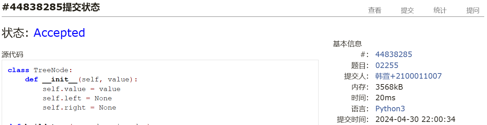

# Assignment #A: 图论：算法，树算及栈 

Updated 2018 GMT+8 Apr 21, 2024

2024 spring, Complied by ==同学的姓名、院系==


**说明：**

1）请把每个题目解题思路（可选），源码Python, 或者C++（已经在Codeforces/Openjudge上AC），截图（包含Accepted），填写到下面作业模版中（推荐使用 typora https://typoraio.cn ，或者用word）。AC 或者没有AC，都请标上每个题目大致花费时间。

2）提交时候先提交pdf文件，再把md或者doc文件上传到右侧“作业评论”。Canvas需要有同学清晰头像、提交文件有pdf、"作业评论"区有上传的md或者doc附件。

3）如果不能在截止前提交作业，请写明原因。


**编程环境**

==（请改为同学的操作系统、编程环境等）==

操作系统：macOS Ventura 13.4.1 (c)

Python编程环境：Spyder IDE 5.2.2, PyCharm 2023.1.4 (Professional Edition)

C/C++编程环境：Mac terminal vi (version 9.0.1424), g++/gcc (Apple clang version 14.0.3, clang-1403.0.22.14.1)


## 1. 题目

### 20743: 整人的提词本

http://cs101.openjudge.cn/practice/20743/


思路：感觉是用stack做，但是不知道具体遇到()应该怎么操作，看了题解，没想到题解也做的这么复杂。


代码

```python
def reverse_parentheses(s):
    stack = []
    for char in s:
        if char == ')':
            temp = []
            while stack and stack[-1] != '(':
                temp.append(stack.pop())
            # remove the opening parenthesis
            if stack:
                stack.pop()
            # add the reversed characters back to the stack
            stack.extend(temp)
        else:
            stack.append(char)
    return ''.join(stack)

# 读取输入并处理
s = input().strip()
print(reverse_parentheses(s))
```


代码运行截图 ==（至少包含有"Accepted"）==


### 02255: 重建二叉树

http://cs101.openjudge.cn/practice/02255/


思路：之前做过这个题，其实就是把笔试题的思路implement一下就行了
The problem is asking to construct a binary tree from given preorder and inorder traversal sequences, and then output the postorder traversal sequence of the constructed tree.  

Here is a step-by-step plan:  
1.Create a TreeNode class to represent each node in the tree.
2.Create a function build_tree that takes the preorder and inorder sequences as input and returns the root of the constructed tree.
	The first character of the preorder sequence is the root of the tree.
	Find the position of the root in the inorder sequence.
	Recursively construct the left subtree using the left part of the inorder sequence and the corresponding part of the preorder sequence.
	Recursively construct the right subtree using the right part of the inorder sequence and the corresponding part of the preorder sequence.
3.Create a function postorder_traversal that takes the root of the tree as input and returns the postorder traversal sequence of the tree.
4.For each pair of preorder and inorder sequences, construct the tree and output the postorder traversal sequence.
Here is the Python code that implements this plan:


代码

```python
class TreeNode:
    def __init__(self, value):
        self.value = value
        self.left = None
        self.right = None

# 递归建树
def build_tree(preorder, inorder):
    if not preorder or not inorder:
        return None
    root_value = preorder[0]
    root = TreeNode(root_value)
    root_index_inorder = inorder.index(root_value)
    root.left = build_tree(preorder[1:1+root_index_inorder], inorder[:root_index_inorder])
    root.right = build_tree(preorder[1+root_index_inorder:], inorder[root_index_inorder+1:])
    return root

def postorder_traversal(root):
    if root is None:
        return ''
    return postorder_traversal(root.left) + postorder_traversal(root.right) + root.value

while True:
    try:
        preorder, inorder = input().split()
        root = build_tree(preorder, inorder)
        print(postorder_traversal(root))
    except EOFError:
        break
```


代码运行截图 ==（至少包含有"Accepted"）==



### 01426: Find The Multiple

http://cs101.openjudge.cn/practice/01426/

要求用bfs实现


思路：没读懂题目的意思，看题解

考虑到我们的结果至多是100位数，我们需要找到一个能被n整除的数字，并且全是0、1，实际上所有位上都是0、1的数字是可以构成一颗二叉树的，我们从1作为根节点，左右儿子分别进行\*10和*10+1操作——并且我们不关心数字实际的大小，而关心这个数mod n的结果，由于mod运算的结合、分配律，所以我们可以进行vis去重，这大大降低了搜索的成本，于是我们直接用bfs就可以了（虽然题目不要求最短这个性质，但即便如此相比之下bfs也比dfs更高效）


对余数进行BFS（广度优先搜索）。思路是从最小的满足条件的数开始搜索，即1，然后通过不断添加0或1在数的末尾来生成新的数字，直到找到一个数字既是n的倍数又只包含数字0和1。

由于直接操作数字可能会很快超出整数范围，特别是当n很大时，我们可以在BFS过程中仅保存数字的模n值以及该数字的十进制表示。每次从队列中取出一个元素，计算加0或加1后的模n值，如果新模n值为0，则找到了解；否则，如果这个模n值是首次访问，则将其加入队列继续搜索。


代码
我自己没用字符串表示数，但是oj过了
```python
from collections import deque

def findthemultiple(n):
    d = deque()
    d.append(1)
    while d:
        temp = d.popleft()
        d.append(temp*10)
        d.append(temp*10+1)
        if temp%n == 0:
            return temp

while True:
    n = int(input())
    print(findthemultiple(n))
```
```
from collections import deque

def find_multiple(n):
    # 使用队列实现BFS
    q = deque()
    # 初始化队列，存储的是(模n值, 对应的数字字符串)
    q.append((1 % n, "1"))
    visited = set([1 % n])  # 用于记录访问过的模n值，避免重复搜索

    while q:
        mod, num_str = q.popleft()

        # 检查当前模n值是否为0，是则找到答案
        if mod == 0:
            return num_str

        # 尝试在当前数字后加0或加1，生成新的数字，并计算模n值
        for digit in ["0", "1"]:
            new_num_str = num_str + digit
            new_mod = (mod * 10 + int(digit)) % n

            # 如果新模n值未访问过，则加入队列继续搜索
            if new_mod not in visited:
                q.append((new_mod, new_num_str))
                visited.add(new_mod)

def main():
    while True:
        n = int(input())
        if n == 0:
            break
        print(find_multiple(n))

if __name__ == "__main__":
    main()
```

代码运行截图 ==（AC代码截图，至少包含有"Accepted"）==


### 04115: 鸣人和佐助

bfs, http://cs101.openjudge.cn/practice/04115/


思路：稍复杂的bfs问题。visited需要维护经过时的最大查克拉数，只有大于T值时候才能通过，然后就是常见bfs。
用一个特殊的bfs，除了记录位置，还要记录剩下的查克拉数量，某个位置能走的前提是，这次走到这个位置所剩下的查克拉，要比上一次来的时候多（初始为-1），其他的和正常bfs相同

###+
@##*
*#*#
***#
k=1的时候走下面才走得通

```python
# 夏天明 元培学院

from collections import deque

# 读取输入的行数M、列数N和初始能量T
M, N, T = map(int, input().split())
# 读取输入的图，将其存储为一个二维列表
graph = [list(input()) for i in range(M)]
# 定义四个方向：右、下、左、上
direc = [(0,1), (1,0), (-1,0), (0,-1)]
# 初始化起点和终点
start, end = None, None
# 找到起点
for i in range(M):
    for j in range(N):
        if graph[i][j] == '@':
            start = (i, j)

# 定义广度优先搜索函数
def bfs():
    # 初始化队列，将起点和初始能量T添加到队列中
    q = deque([start + (T, 0)])
    # 初始化访问列表，记录每个位置的能量值，初始值为-1
    visited = [[-1]*N for i in range(M)]
    # 将起点的能量值设置为T
    visited[start[0]][start[1]] = T
    # 当队列不为空时，进行循环
    while q:
        # 从队列中取出一个元素，包括其坐标、能量值和时间
        x, y, t, time = q.popleft()
        # 时间增加1
        time += 1
        # 遍历四个方向
        for dx, dy in direc:
            # 如果新的坐标在图内
            if 0<=x+dx<M and 0<=y+dy<N:
                # 如果新的位置是'*'，并且当前能量值大于该位置的能量值
                if (elem := graph[x+dx][y+dy]) == '*' and t > visited[x+dx][y+dy]:
                    # 更新该位置的能量值
                    visited[x+dx][y+dy] = t
                    # 将新的位置和能量值添加到队列中
                    q.append((x+dx, y+dy, t, time))
                # 如果新的位置是'#'，并且当前能量值大于0，并且当前能量值-1大于该位置的能量值
                elif elem == '#' and t > 0 and t-1 > visited[x+dx][y+dy]:
                    # 更新该位置的能量值
                    visited[x+dx][y+dy] = t-1
                    # 将新的位置和能量值-1添加到队列中
                    q.append((x+dx, y+dy, t-1, time))
                # 如果新的位置是'+'，则返回时间
                elif elem == '+':
                    return time
    # 如果没有找到'+'，则返回-1
    return -1

# 打印广度优先搜索的结果
print(bfs())
```


代码运行截图 ==（AC代码截图，至少包含有"Accepted"）==


### 20106: 走山路

Dijkstra, http://cs101.openjudge.cn/practice/20106/


思路：


代码

```python
# 23 蒋子轩
from heapq import heappop, heappush

# 定义广度优先搜索函数
def bfs(x1, y1):
    # 初始化优先队列，将起点和时间0添加到队列中
    q = [(0, x1, y1)]
    # 初始化已访问的位置集合
    visited = set()
    # 当队列不为空时，进行循环
    while q:
        # 从队列中取出一个元素，包括其时间和位置
        t, x, y = heappop(q)
        # 如果这个位置已经被访问过，就跳过这次循环
        if (x, y) in visited:
            continue
        # 将这个位置添加到已访问的位置集合中
        visited.add((x, y))
        # 如果这个位置是终点，就返回时间
        if x == x2 and y == y2:
            return t
        # 遍历四个方向
        for dx, dy in dir:
            # 计算新的位置
            nx, ny = x+dx, y+dy
            # 如果新的位置在地图内，且不是'#'，且没有被访问过
            if 0 <= nx < m and 0 <= ny < n and \
                    ma[nx][ny] != '#' and (nx, ny) not in visited:
                # 计算新的时间
                nt = t+abs(int(ma[nx][ny])-int(ma[x][y]))
                # 将新的位置和时间添加到队列中
                heappush(q, (nt, nx, ny))
    # 如果没有找到终点，就返回'NO'
    return 'NO'


# 读取输入的行数m、列数n和查询次数p
m, n, p = map(int, input().split())
# 读取输入的地图，将其存储为一个二维列表
ma = [list(input().split()) for _ in range(m)]
# 定义四个方向：下、上、右、左
dir = [(1, 0), (-1, 0), (0, 1), (0, -1)]
# 对每一次查询
for _ in range(p):
    # 读取输入的起点和终点
    x1, y1, x2, y2 = map(int, input().split())
    # 如果起点或终点是'#'，就打印'NO'，并跳过这次查询
    if ma[x1][y1] == '#' or ma[x2][y2] == '#':
        print('NO')
        continue
    # 打印广度优先搜索的结果
    print(bfs(x1, y1))
```


代码运行截图 ==（AC代码截图，至少包含有"Accepted"）==


### 05442: 兔子与星空

Prim, http://cs101.openjudge.cn/practice/05442/


思路：
以下是Kruskal算法的基本步骤：
1. 将图中的所有边按照权重从⼩到⼤进⾏排序。
2. 初始化⼀个空的边集，⽤于存储最⼩⽣成树的边。
3. 重复以下步骤，直到边集中的边数等于顶点数减⼀或者所有边都已经考虑完毕：
选择排序后的边集中权重最⼩的边。
如果选择的边不会导致形成环路（即加⼊该边后，两个顶点不在同⼀个连通分量中），则将该边加⼊最
⼩⽣成树的边集中。
4. 返回最⼩⽣成树的边集作为结果。

用的kruskal，这个算法比那些用图的算法看起来明白多了

kruskal适配这种vertex.key连续变化的情况，因为并查集建立还有find方法中都要用到列表的有序性。


代码

```python
# 蔡嘉华 物理学院
class DisjSet:
    def __init__(self, n):
        self.parent = [i for i in range(n)]
        self.rank = [0]*n
    
    def find(self, x):
        if self.parent[x] != x:
            self.parent[x] = self.find(self.parent[x])
        return self.parent[x]
    
    def union(self, x, y):
        xset, yset = self.find(x), self.find(y)
        if self.rank[xset] > self.rank[yset]:
            self.parent[yset] = xset
        else:
            self.parent[xset] = yset
            if self.rank[xset] == self.rank[yset]:
                self.rank[yset] += 1

def kruskal(n, edges):
    # 初始化一个并查集
    dset = DisjSet(n)
    # 将所有的边按照权重进行排序
    edges.sort(key = lambda x:x[2])
    # 初始化最小生成树的权重和为0
    sol = 0
    # 遍历所有的边
    for u, v, w in edges:
        # 将顶点的字符表示转换为数字表示
        u, v = ord(u)-65, ord(v)-65
        # 如果两个顶点不在同一个集合中
        if dset.find(u) != dset.find(v):
            # 将两个集合合并
            dset.union(u, v)
            # 将这条边的权重加到最小生成树的权重和中
            sol += w
    # 如果最后并查集中的集合数量大于1，说明图不连通，返回-1
    if len(set(dset.find(i) for i in range(n))) > 1:
        return -1
    # 返回最小生成树的权重和
    return sol

# 读取顶点的数量
n = int(input())
# 初始化边的列表
edges = []
# 读取每个顶点的边
for _ in range(n-1):
    arr = input().split()
    root, m = arr[0], int(arr[1])
    # 将每条边的起点、终点和权重添加到边的列表中
    for i in range(m):
        edges.append((root, arr[2+2*i], int(arr[3+2*i])))
# 打印最小生成树的权重和
print(kruskal(n, edges))
```


代码运行截图 ==（AC代码截图，至少包含有"Accepted"）==


## 2. 学习总结和收获

==如果作业题目简单，有否额外练习题目，比如：OJ“2024spring每日选做”、CF、LeetCode、洛谷等网站题目。==


