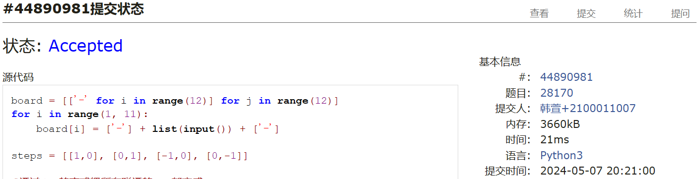

# 之前欠下的assignment8和9都交上去了，因为还没看完图的其他算法，所以这次的作业暂时先做了两道dfs的题目，争取尽快补上进度！Assignment #B: 图论和树算

Updated 1709 GMT+8 Apr 28, 2024

2024 spring, Complied by ==同学的姓名、院系==


**说明：**

1）请把每个题目解题思路（可选），源码Python, 或者C++（已经在Codeforces/Openjudge上AC），截图（包含Accepted），填写到下面作业模版中（推荐使用 typora https://typoraio.cn ，或者用word）。AC 或者没有AC，都请标上每个题目大致花费时间。

2）提交时候先提交pdf文件，再把md或者doc文件上传到右侧“作业评论”。Canvas需要有同学清晰头像、提交文件有pdf、"作业评论"区有上传的md或者doc附件。

3）如果不能在截止前提交作业，请写明原因。


**编程环境**

==（请改为同学的操作系统、编程环境等）==

操作系统：macOS Ventura 13.4.1 (c)

Python编程环境：Spyder IDE 5.2.2, PyCharm 2023.1.4 (Professional Edition)

C/C++编程环境：Mac terminal vi (version 9.0.1424), g++/gcc (Apple clang version 14.0.3, clang-1403.0.22.14.1)


## 1. 题目

### 28170: 算鹰

dfs, http://cs101.openjudge.cn/practice/28170/


思路：这是我真正意义上完全自己写的dfs，首先谢谢群里的同学们帮我正确理解了题意，然后鼓捣了半天，虽然还是不能很快一步到位ac，但还是能根据自己对于递归的理解慢慢写对了


代码

```python
board = [['-' for i in range(12)] for j in range(12)]
for i in range(1, 11):
    board[i] = ['-'] + list(input()) + ['-']

steps = [[1,0], [0,1], [-1,0], [0,-1]]

#通过dfs的方式把所有联通的'.'都变成'-'
def dfs(x,y):
    global ans
    for step in steps:
        nx, ny = x+step[0], y+step[1]
        if board[nx][ny] == '.':
            board[nx][ny] = '-'
            dfs(nx, ny)
    else:
        board[x][y] = '-'
        return
    
ans = 0
for i in range(1, 11):
    for j in range(1, 11):
        if board[i][j] == '.':
            board[i][j] = '-'
            dfs(i, j)
            ans += 1
print(ans)

```


代码运行截图 ==（至少包含有"Accepted"）==



### 02754: 八皇后

dfs, http://cs101.openjudge.cn/practice/02754/


思路：dfs小练习，计概的时候看的题解，现在自己写一遍，本来以为问题不大，但还是一直ac不了，为了节省时间，我就看题解了。

这个是我自己写的失败的代码
```python
answers = []
board = [['available']*8 for i in range(8)]
def crossout_board(x,y,board):
    for j in range(1,8):
        if board[j][y] == 'available':
            board[j][y] = 'unavailable'
        if y+j < 8 and x+j < 8 and board[x+j][y+j] == 'available':
            board[x+j][y+j] = 'unavailable'
        if y-j >= 0 and x+j < 8 and board[x+j][y-j] == 'available':
            board[x+j][y-j] = 'unavailable'
    return board

def reset_board(x,board):
    for j in range(1,8):
        if x+j < 8:
            board[x+j] = ['available']*8
    return board


def dfs(x,board):
    global answers
    if x>=8:
        answer = []
        for i in range(8):
            for j in range(8):
                if board[i][j] == 'queen':
                    answer.append(j+1)
        #把answer转化成字符串
        answers.append(''.join(map(str,answer)))
        return
    
    else:
        for i in range(8):
            if board[x][i] == 'available':
                board[x][i] = 'queen'
                board = crossout_board(x,i,board)
                dfs(x+1,board)
                board = reset_board(x,board)
    
dfs(0,board)

for i in range(int(input())):
    print(answers[int(input())-1])
```


题解代码，超级简洁，学习一下，我自己的话确实想不到
和我相比，他的dfs函数传递了最简洁的参数，一个长度为8的列表来表示之前queen的位置，一个int来表示当前处于哪一行

```python
ans = []
def queen(A, cur=0):				#考虑放第cur行的皇后
    if cur == len(A):				#如果已经放了n个皇后，一组新的解产生了
        ans.append(''.join([str(x+1) for x in A])) 
        return 
    
    for col in range(len(A)): 		#将当前皇后逐一放置在不同的列，每列对应一组解
        flag = 1
        for row in range(cur):		#逐一判定，与前面的皇后是否冲突，如果是在第n行，那么判断0,...,n-1行
            if A[row] == col or abs(col - A[row]) == cur - row: #这个判断函数我感觉是最难想出来的，这里写的很简洁很优雅
                flag = 0
                break
        if flag:                       #若都不冲突
            A[cur] = col            #放置新皇后，在cur行，col列			
            queen(A, cur+1)			#对下一个皇后位置进行递归
            
    return
            
queen([None]*8)   
for _ in range(int(input())):
    print(ans[int(input()) - 1])
```


代码运行截图 ==（至少包含有"Accepted"）==


### 03151: Pots

bfs, http://cs101.openjudge.cn/practice/03151/


思路：题解


代码

```python
# 23生科崔灏梵
def bfs(A, B, C):
    start = (0, 0)
    visited = set()
    visited.add(start)
    queue = [(start, [])]

    while queue:
        (a, b), actions = queue.pop(0)

        if a == C or b == C:
            return actions

        next_states = [(A, b), (a, B), (0, b), (a, 0), (min(a + b, A),\
                max(0, a + b - A)), (max(0, a + b - B), min(a + b, B))]

        for i in next_states:
            if i not in visited:
                visited.add(i)
                new_actions = actions + [get_action(a, b, i)]
                queue.append((i, new_actions))

    return ["impossible"]


def get_action(a, b, next_state):
    if next_state == (A, b):
        return "FILL(1)"
    elif next_state == (a, B):
        return "FILL(2)"
    elif next_state == (0, b):
        return "DROP(1)"
    elif next_state == (a, 0):
        return "DROP(2)"
    elif next_state == (min(a + b, A), max(0, a + b - A)):
        return "POUR(2,1)"
    else:
        return "POUR(1,2)"


A, B, C = map(int, input().split())
solution = bfs(A, B, C)

if solution == ["impossible"]:
    print(solution[0])
else:
    print(len(solution))
    for i in solution:
        print(i)
```


代码运行截图 ==（AC代码截图，至少包含有"Accepted"）==


### 05907: 二叉树的操作

http://cs101.openjudge.cn/practice/05907/


思路：用字典+列表的确比类方便

```python
# 数学科学学院 王镜廷 2300010724
def find_leftmost_node(son, u):
    while son[u][0] != -1:
        u = son[u][0]
    return u

def main():
    t = int(input())
    for _ in range(t):
        n, m = map(int, input().split())

        son = [-1] * (n + 1)  # 存储每个节点的子节点
        parent = {}  # 存储每个节点的父节点和方向，{节点: (父节点, 方向)}

        for _ in range(n):
            i, u, v = map(int, input().split())
            son[i] = [u, v]
            parent[u] = (i, 0)  # 左子节点
            parent[v] = (i, 1)  # 右子节点

        for _ in range(m):
            s = input().split()
            if s[0] == "1":
                u, v = map(int, s[1:])
                fu, diru = parent[u]
                fv, dirv = parent[v]
                son[fu][diru] = v
                son[fv][dirv] = u
                parent[v] = (fu, diru)
                parent[u] = (fv, dirv)
            elif s[0] == "2":
                u = int(s[1])
                root = find_leftmost_node(son, u)
                print(root)

if __name__ == "__main__":
    main()
```


代码运行截图 ==（AC代码截图，至少包含有"Accepted"）==


### 18250: 冰阔落 I

Disjoint set, http://cs101.openjudge.cn/practice/18250/


思路：并查集的普遍问题：各节点的根没有及时更新到最深的根，各个节点的更新不是及时的。这道题里只有最深层的根是有效的。

在并查集中，当一个节点的根节点更新为另一个节点时，如果该节点之后再次被更新为另一个节点的子节点，就会导致路径压缩未完全实现的情况。这可能会使得某些节点的根节点不是最深的根节点，而是更新过程中的某个中间节点。

例如：A路径压缩更新到B，但是B后来又更新为C了，导致A的根结点不是C。


```python
def find(x):
    if parent[x] != x:
        parent[x] = find(parent[x])
    return parent[x]

def union(x, y):
    root_x = find(x)
    root_y = find(y)
    if root_x != root_y:
        parent[root_y] = root_x

while True:
    try:
        n, m = map(int, input().split())
        parent = list(range(n + 1))

        for _ in range(m):
            a, b = map(int, input().split())
            if find(a) == find(b):
                print('Yes')
            else:
                print('No')
                union(a, b)

        unique_parents = set(find(x) for x in range(1, n + 1))  # 获取不同集合的根节点
        ans = sorted(unique_parents)  # 输出有冰阔落的杯子编号
        print(len(ans))
        print(*ans)

    except EOFError:
        break
```


代码运行截图 ==（AC代码截图，至少包含有"Accepted"）==


### 05443: 兔子与樱花

http://cs101.openjudge.cn/practice/05443/


思路：


代码

```python
# 谭琳诗倩、2200013722
import heapq
import math
def dijkstra(graph,start,end,P):
    if start == end: return []
    dist = {i:(math.inf,[]) for i in graph}
    dist[start] = (0,[start])
    pos = []
    heapq.heappush(pos,(0,start,[]))
    while pos:
        dist1,current,path = heapq.heappop(pos)
        for (next,dist2) in graph[current].items():
            if dist2+dist1 < dist[next][0]:
                dist[next] = (dist2+dist1,path+[next])
                heapq.heappush(pos,(dist1+dist2,next,path+[next]))
    return dist[end][1]

P = int(input())
graph = {input():{} for _ in range(P)}
for _ in range(int(input())):
    place1,place2,dist = input().split()
    graph[place1][place2] = graph[place2][place1] = int(dist)

for _ in range(int(input())):
    start,end = input().split()
    path = dijkstra(graph,start,end,P)
    s = start
    current = start
    for i in path:
        s += f'->({graph[current][i]})->{i}'
        current = i
    print(s)
```


代码运行截图 ==（AC代码截图，至少包含有"Accepted"）==


## 2. 学习总结和收获

==如果作业题目简单，有否额外练习题目，比如：OJ“2024spring每日选做”、CF、LeetCode、洛谷等网站题目。==
时间来不及就直接看题解了，大三最近有点忙


