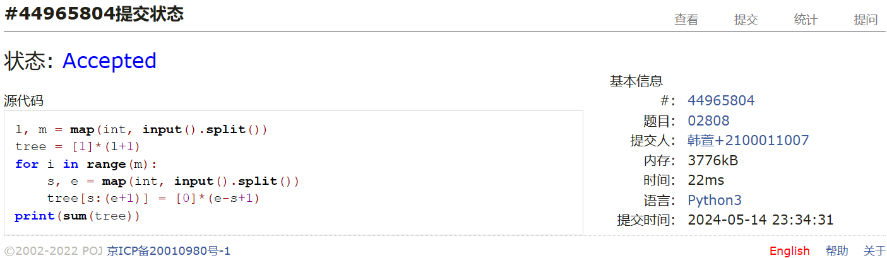
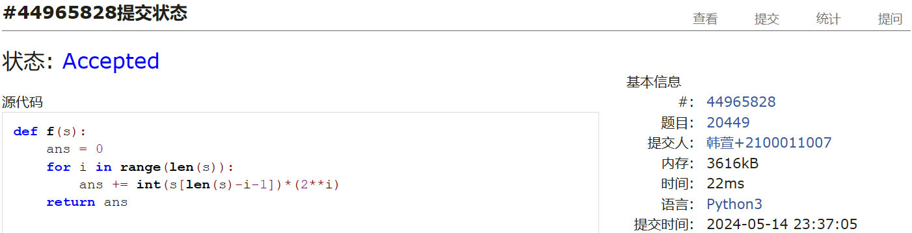
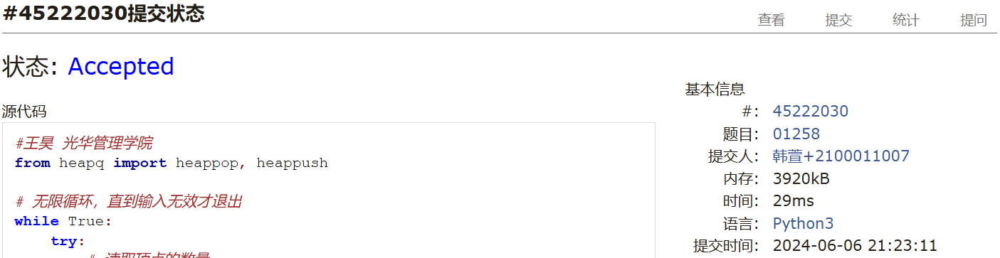
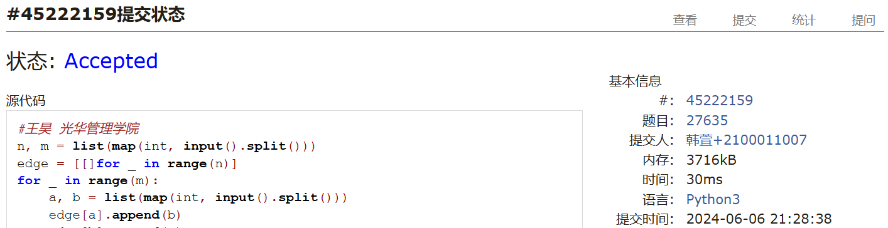
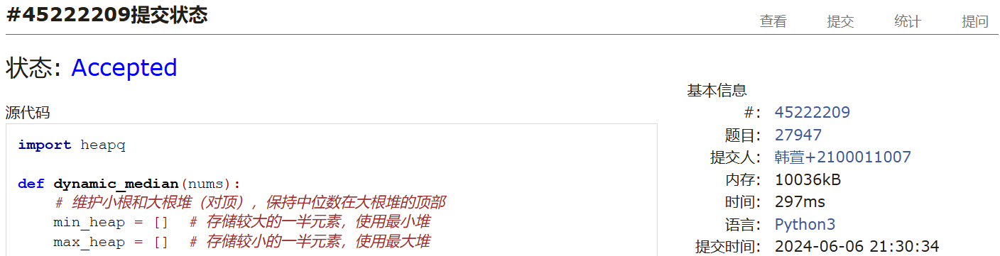
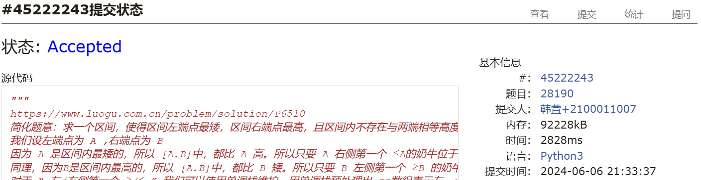

# Assignment #D: May月考

Updated 1654 GMT+8 May 8, 2024

2024 spring, Complied by ==同学的姓名、院系==


**说明：**

1）请把每个题目解题思路（可选），源码Python, 或者C++（已经在Codeforces/Openjudge上AC），截图（包含Accepted），填写到下面作业模版中（推荐使用 typora https://typoraio.cn ，或者用word）。AC 或者没有AC，都请标上每个题目大致花费时间。

2）提交时候先提交pdf文件，再把md或者doc文件上传到右侧“作业评论”。Canvas需要有同学清晰头像、提交文件有pdf、"作业评论"区有上传的md或者doc附件。

3）如果不能在截止前提交作业，请写明原因。


**编程环境**

==（请改为同学的操作系统、编程环境等）==

操作系统：macOS Ventura 13.4.1 (c)

Python编程环境：Spyder IDE 5.2.2, PyCharm 2023.1.4 (Professional Edition)

C/C++编程环境：Mac terminal vi (version 9.0.1424), g++/gcc (Apple clang version 14.0.3, clang-1403.0.22.14.1)


## 1. 题目

### 02808: 校门外的树

http://cs101.openjudge.cn/practice/02808/


思路：


代码

```python
l, m = map(int, input().split())
tree = [1]*(l+1)
for i in range(m):
    s, e = map(int, input().split())
    tree[s:(e+1)] = [0]*(e-s+1)
print(sum(tree))
```


代码运行截图 ==（至少包含有"Accepted"）==



### 20449: 是否被5整除

http://cs101.openjudge.cn/practice/20449/


思路：我记得应该有一个二进制转十进制的函数来着，但是我忘了，只能自己写了一个，挺麻烦的


代码

```python
def f(s):
    ans = 0
    for i in range(len(s)):
        ans += int(s[len(s)-i-1])*(2**i)
    return ans


s = input()
ans = ''
for i in range(len(s)):
    if f(s[:i+1]) % 5 == 0:
        ans += '1'
    else:
        ans += '0'
print(ans)
```


代码运行截图 ==（至少包含有"Accepted"）==



### 01258: Agri-Net

http://cs101.openjudge.cn/practice/01258/


思路：


代码

```python
#王昊 光华管理学院
from heapq import heappop, heappush

# 无限循环，直到输入无效才退出
while True:
    try:
        # 读取顶点的数量
        n = int(input())
    except:
        # 如果输入无效，退出循环
        break
    # 初始化邻接矩阵和当前节点
    mat, cur = [], 0
    # 读取邻接矩阵
    for i in range(n):
        mat.append(list(map(int, input().split())))
    # 初始化距离数组、已访问节点集合、优先队列和最小生成树的权重和
    d, v, q, cnt = [100000 for i in range(n)], set(), [], 0
    # 将起点的距离设为0
    d[0] = 0
    # 将起点添加到优先队列中
    heappush(q, (d[0], 0))
    # 当优先队列不为空时，进行循环
    while q:
        # 从优先队列中取出一个节点，包括其距离和编号
        x, y = heappop(q)
        # 如果这个节点已经被访问过，就跳过这次循环
        if y in v:
            continue
        # 将这个节点添加到已访问节点集合中
        v.add(y)
        # 将这个节点的距离加到最小生成树的权重和中
        cnt += d[y]
        # 遍历所有的节点
        for i in range(n):
            # 如果这个节点的距离大于当前节点到这个节点的距离
            if d[i] > mat[y][i]:
                # 更新这个节点的距离
                d[i] = mat[y][i]
                # 将这个节点添加到优先队列中
                heappush(q, (d[i], i))
    # 打印最小生成树的权重和
    print(cnt)
```


代码运行截图 ==（AC代码截图，至少包含有"Accepted"）==



### 27635: 判断无向图是否连通有无回路(同23163)

http://cs101.openjudge.cn/practice/27635/


思路：dfs能直接判断是否连通，过程中记录父亲节点，只要当前节点能够去到一个已经遍历过的节点，并且这个节点不是父亲节点，那么必然成环，以及连通和成环是可以同时判断的

```python
#王昊 光华管理学院
n, m = list(map(int, input().split()))
edge = [[]for _ in range(n)]
for _ in range(m):
    a, b = list(map(int, input().split()))
    edge[a].append(b)
    edge[b].append(a)
cnt, flag = set(), False


def dfs(x, y):
    global cnt, flag
    cnt.add(x)
    for i in edge[x]:
        if i not in cnt:
            dfs(i, x)
        elif y != i:
            flag = True


for i in range(n):
    cnt.clear()
    dfs(i, -1)
    if len(cnt) == n:
        break
    if flag:
        break

print("connected:"+("yes" if len(cnt) == n else "no"))
print("loop:"+("yes" if flag else 'no'))
```


代码运行截图 ==（AC代码截图，至少包含有"Accepted"）==



### 27947: 动态中位数

http://cs101.openjudge.cn/practice/27947/


思路：左堆扔右堆，保持左堆的元素个数大于等于右堆，如果左堆的元素个数比右堆多2个，那么就把左堆的堆顶元素扔到右堆，这样中位数就是左堆的堆顶元素

代码

```python
import heapq

def dynamic_median(nums):
    # 维护小根和大根堆（对顶），保持中位数在大根堆的顶部
    min_heap = []  # 存储较大的一半元素，使用最小堆
    max_heap = []  # 存储较小的一半元素，使用最大堆

    median = []
    for i, num in enumerate(nums):
        # 根据当前元素的大小将其插入到对应的堆中
        if not max_heap or num <= -max_heap[0]:
            heapq.heappush(max_heap, -num)
        else:
            heapq.heappush(min_heap, num)

        # 调整两个堆的大小差，使其不超过 1
        if len(max_heap) - len(min_heap) > 1:
            heapq.heappush(min_heap, -heapq.heappop(max_heap))
        elif len(min_heap) > len(max_heap):
            heapq.heappush(max_heap, -heapq.heappop(min_heap))

        if i % 2 == 0:
            median.append(-max_heap[0])

    return median

T = int(input())
for _ in range(T):
    #M = int(input())
    nums = list(map(int, input().split()))
    median = dynamic_median(nums)
    print(len(median))
    print(*median)
```


代码运行截图 ==（AC代码截图，至少包含有"Accepted"）==



### 28190: 奶牛排队

http://cs101.openjudge.cn/practice/28190/


思路：利用单调栈， left_bound用于记录以当前点为最右端，满足条件的最左端的索引减1； right_bound用于记录以当前节点为最左端，满足条件的最右端的索引加1，最终答案就是两段拼起来之后的最长长度。


代码

```python

"""
https://www.luogu.com.cn/problem/solution/P6510
简化题意：求一个区间，使得区间左端点最矮，区间右端点最高，且区间内不存在与两端相等高度的奶牛，输出这个区间的长度。
我们设左端点为 A ,右端点为 B
因为 A 是区间内最矮的，所以 [A.B]中，都比 A 高。所以只要 A 右侧第一个 ≤A的奶牛位于 B 的右侧，则 A 合法
同理，因为B是区间内最高的，所以 [A.B]中，都比 B 矮。所以只要 B 左侧第一个 ≥B 的奶牛位于 A的左侧，则 B合法
对于 “ 左/右侧第一个 ≥/≤ ” 我们可以使用单调栈维护。用单调栈预处理出 zz数组表示左，r 数组表示右。
然后枚举右端点 B寻找 A，更新 ans 即可。

这个算法的时间复杂度为 O(n)，其中 n 是奶牛的数量。
"""

N = int(input())
heights = [int(input()) for _ in range(N)]

left_bound = [-1] * N
right_bound = [N] * N

stack = []  # 单调栈，存储索引

# 求左侧第一个≥h[i]的奶牛位置
for i in range(N):
    while stack and heights[stack[-1]] < heights[i]:
        stack.pop()

    if stack:
        left_bound[i] = stack[-1]

    stack.append(i)

stack = []  # 清空栈以供寻找右边界使用

# 求右侧第一个≤h[i]的奶牛位
for i in range(N-1, -1, -1):
    while stack and heights[stack[-1]] > heights[i]:
        stack.pop()

    if stack:
        right_bound[i] = stack[-1]

    stack.append(i)

ans = 0

# for i in range(N-1, -1, -1):  # 从大到小枚举是个技巧
#     for j in range(left_bound[i] + 1, i):
#         if right_bound[j] > i:
#             ans = max(ans, i - j + 1)
#             break
#
#     if i <= ans:
#         break

for i in range(N):  # 枚举右端点 B寻找 A，更新 ans
    for j in range(left_bound[i] + 1, i):
        if right_bound[j] > i:
            ans = max(ans, i - j + 1)
            break
print(ans)
```


代码运行截图 ==（AC代码截图，至少包含有"Accepted"）==



## 2. 学习总结和收获

==如果作业题目简单，有否额外练习题目，比如：OJ“2024spring每日选做”、CF、LeetCode、洛谷等网站题目。==
目前还正在看dijsktra算法和prim算法，所以两个模板题还没做，不过应该不难
hard的两个算法题应该是最难的，我会继续努力，争取在期末考试前把这两个题目做出来


